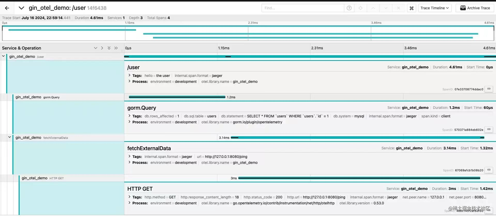
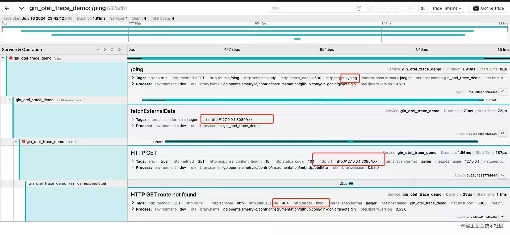
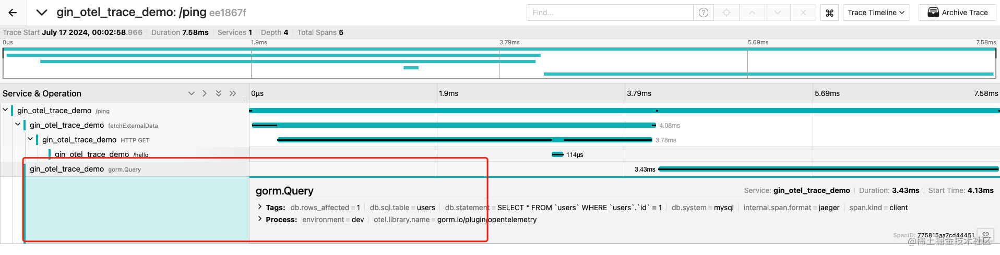
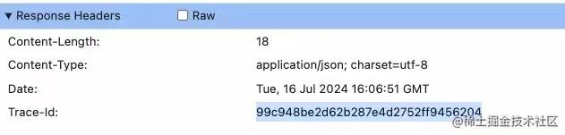

## 背景:

日志追踪，又名 Trace。和 Metric 和 Log  构成了可观测领域三个主要组成部分，Metric 和 Log 相较于 Trace 使用的更广泛一些，主要原因可能是 Metric 本身有比较成熟的解决方案。比如 Metric 对应 Prometheus，Log 有 Es 相关套件。而 Trace 目前比较知名的就是 Jaeger 这个工具了，而在 Opentelemetry 诞生之前, 存在 OpenCensus 和 OpenTracing 两种规范，也给 Trace 的接入造成一定的门槛。而 Opentelemetry 统一了 Trace 的标准和协议，可以看到国内的两个主流的 Go Web 框架，go-zero 和 go-frame 都已经全面拥抱了 Opentelemetry 集成 Trace 和 Mertic。而 Gin 作为使用最广泛的 Go Web 框架，却很少找到写的很全面的集成 Opentelemetry Trace 的教程，这也是我写这个系列的目的:

这个系列目前共计划两篇文章:

1. 日志追踪 Trace
2. Metric 接入实战

两篇文章都会提供核心代码，其中 Metric 部分已经作为开源工具 [gin-prometheus](https://github.com/hanshuaikang/gin-prometheus) 并开源。

本文主要达到两个效果:
- 集成 gin 日志追踪，并上报到 jaeger 
- gorm 和 http 请求集成

最终展示的效果如下:

该实例提供了一个 /user 接口，该接口会去 db 查询 user 信息, 并请求第三方的接口，根据下图我们可以清晰的看到调用路径。


## 初始化一个 gin 项目

```golang

package main

import (
    "github.com/gin-gonic/gin"
)

func ping(c *gin.Context) {
    c.JSON(http.StatusOK, gin.H{
       "message": "pong",
    })
}

func main() {
    r := gin.Default()
    r.GET("/ping", ping)
    r.Run() // listen and serve on 0.0.0.0:8080 (for windows "localhost:8080")
}

```

启动项目, 访问 `localhost:8080/ping` 确保应用是正常的。

## 集成 Opentelemetry 并定义 Trace Provider


### 安装 Opentelemetry 相关依赖
```bash
go get "go.opentelemetry.io/contrib/instrumentation/net/http/otelhttp@v0.53.0"
go get "go.opentelemetry.io/otel@v1.28.0"
go get "go.opentelemetry.io/otel/exporters/jaeger@v1.17.0"
go get "go.opentelemetry.io/otel/trace@v1.28.0"
go get "go.opentelemetry.io/otel/sdk@v1.28.0"
```

### 初始化 Trace Provider 

现在让我们在项目根目录下新建一个 provider.go , 由于是演示 demo, 文件会以比较简陋的方式组织。

``` golang
package main

import (
    "go.opentelemetry.io/otel"
    "go.opentelemetry.io/otel/attribute"
    "go.opentelemetry.io/otel/exporters/jaeger"
    "go.opentelemetry.io/otel/propagation"
    "go.opentelemetry.io/otel/sdk/resource"
    tracesdk "go.opentelemetry.io/otel/sdk/trace"
    semconv "go.opentelemetry.io/otel/semconv/v1.26.0"
)

const (
    service = "gin_otel_trace_demo"
    env     = "dev"
)

var Tracer = otel.Tracer(service)

func TracerProvider() (*tracesdk.TracerProvider, error) {
    // Create the Jaeger exporter
    exp, err := jaeger.New(jaeger.WithCollectorEndpoint())
    if err != nil {
       return nil, err
    }
    tp := tracesdk.NewTracerProvider(
       // Always be sure to batch in production.
       tracesdk.WithSampler(tracesdk.AlwaysSample()),
       tracesdk.WithBatcher(exp),
       tracesdk.WithResource(resource.NewWithAttributes(
          semconv.SchemaURL,
          semconv.ServiceName(service),
          // 这里可以定义一些全局属性
          attribute.String("environment", env),
       ),
       ),
    )

    // Register our TracerProvider as the global so any imported
    // instrumentation in the future will default to using it.
    otel.SetTracerProvider(tp)
    otel.SetTextMapPropagator(propagation.NewCompositeTextMapPropagator(propagation.TraceContext{}, propagation.Baggage{}))

    return tp, nil
}
```

### 在项目启动时初始化 TracerProvider

```golang
package main

import (
    "context"
    "github.com/gin-gonic/gin"
    "log"
)

func main() {
    // 主要看这里
    tp, err :=  TracerProvider()
    if err != nil {
       log.Fatal(err)
    }

    // Cleanly shutdown and flush telemetry when the application exits.
    defer func() {
       if err := tp.Shutdown(context.Background()); err != nil {
          log.Fatal(err)
       }
    }()
    r := gin.Default()
    r.GET("/ping", ping)
    r.Run() // listen and serve on 0.0.0.0:8080 (for windows "localhost:8080")
}
```

这个时候我们的 gin 还没有和 opentelemetry 组合完成进化, 我们需要安装 opentelemetry 提供的 gin 中间件。

```bash
go get "go.opentelemetry.io/contrib/instrumentation/github.com/gin-gonic/gin/otelgin"
```

安装该中间件：

```golang
//....
r := gin.Default()
r.Use(otelgin.Middleware(service))
//....
```

## 安装并启动 Jaeger ：
Jaeger 官网：https://www.jaegertracing.io/docs/1.58/getting-started/

根据官方提供的一键启动命令，以 docker 启动。
```bash
docker run --rm --name jaeger \
  -e COLLECTOR_ZIPKIN_HOST_PORT=:9411 \
  -p 6831:6831/udp \
  -p 6832:6832/udp \
  -p 5778:5778 \
  -p 16686:16686 \
  -p 4317:4317 \
  -p 4318:4318 \
  -p 14250:14250 \
  -p 14268:14268 \
  -p 14269:14269 \
  -p 9411:9411 \
  jaegertracing/all-in-one:1.58
```

启动完成之后浏览器访问 http://127.0.0.1:16686/ 便可进入 jaeger 的 web 页面。


### 启动我们的 gin 项目

访问 http://127.0.0.1:8080/ping 路由



可以看到 Trace 的信息已经报上去了。


## 集成 otelhttp 实现请求追踪

Trace 虽然上报给了 Jaeger，但是此时只有日志，但是缺少了追踪，看来我们不得不加一些新的方法延长我们的请求路径了。

安装 otelhttp:
```bash
go get "go.opentelemetry.io/contrib/instrumentation/net/http/otelhttp@v0.53.0"
```

编写一个 http 请求的接口, 如下:

```golang
package main

import (
    "context"
    "encoding/json"
    "github.com/gin-gonic/gin"
    "go.opentelemetry.io/contrib/instrumentation/net/http/otelhttp"
    "go.opentelemetry.io/otel/attribute"
    oteltrace "go.opentelemetry.io/otel/trace"
    "net/http"
)


func fetchExternalData(ctx context.Context, url string) (map[string]interface{}, error) {
    // Trace 打点，很重要
    ctx, span := Tracer.Start(ctx, "fetchExternalData", oteltrace.WithAttributes(attribute.String("url", url)))
    defer span.End()

    client := http.Client{
       Transport: otelhttp.NewTransport(http.DefaultTransport),
    }
    req, err := http.NewRequestWithContext(ctx, "GET", url, nil)
    if err != nil {
       return nil, err
    }

    resp, err := client.Do(req)
    if err != nil {
       return nil, err
    }
    defer resp.Body.Close()

    var result map[string]interface{}
    if err := json.NewDecoder(resp.Body).Decode(&result); err != nil {
       return nil, err
    }

    return result, nil
}

func ping(c *gin.Context) {
    // 注意这里要传递 c.Request.Context()
    _, err := fetchExternalData(c.Request.Context(), "http://127.0.0.1:8080/xxx")
    if err != nil {
       c.JSON(http.StatusInternalServerError, gin.H{
          "message": err.Error(),
       })
       return
    }
    c.JSON(http.StatusOK, gin.H{
       "message": "pong",
    })
}
```

由于 `http://127.0.0.1:8080/xxx` 是 404 会导致 `fetchExternalData`异常，最终造成 ping 请求 500。

这个时候我们再查看 jaeger, 发现新增了一个包含了 4 个 span 的 trace。


### 埋点
当我们需要为我们的请求链路增加日志追踪时，只需要定义新的 span，并将新的 ctx 向下传递即可。
```golang
    // Trace 打点，很重要
    ctx, span := Tracer.Start(ctx, "fetchExternalData", oteltrace.WithAttributes(attribute.String("url", url)))
    defer span.End()
```

根据我的体会，当我们写新功能的时候，埋 trace 会变成一个很自然的动作，就跟写 if err != nil 一样。本质上不会增加太多的工作量，但是当遇到问题需要排查时，trace 往往可以带来大作用。可以很大的提高排查问题的效率。

## Gorm 接入 Trace
Gorm 接入 Trace 同样也非常简单，我们只需要安装 Trace 相关的插件即可, Gorm 官方提供了 Opentelemetry 的插件。

https://github.com/go-gorm/opentelemetry

安装:
```bash
go get https://github.com/go-gorm/opentelemetry
```

## 为 Gorm 安装 opentelemetry 插件。

非常简单，只需要定义的时候 Use 一下即可。
```golang
package main

import (
    "gin_otel/domain"
    "gorm.io/driver/mysql"
    "gorm.io/gorm"
    "gorm.io/plugin/opentelemetry/tracing"
)

var DB *gorm.DB

func init() {
    dsn := "xxx"
    var err error
    DB, err = gorm.Open(mysql.Open(dsn), &gorm.Config{})
    if err != nil {
       panic(err)
    }
    // 这一行，这种是不带 metric 的，详细使用可以看官方文档
    if err := DB.Use(tracing.NewPlugin(tracing.WithoutMetrics())); err != nil {
       panic(err)
    }
}
```

当然，查询的时候也需要关联上对应的 context:
核心关注: `db.DB.WithContext(c)`
```golang
func GetUserFromDb(c context.Context, userId int64) domain.User {
    user := domain.User{ID: userId}
    // 主要是 WithContext 这里
    if err := db.DB.WithContext(c).Find(&user).Error; err != nil {
       return domain.User{}
    }
    return user
```

当你调用 DB 查询查询时，就能直接看到 Gorm 相关的 query trace 了




## 为 Gin Response Header 添加 Trace 信息
这个时候还差最后一步，我怎么能够知道 Trace 对应的是哪个请求呢？ 我们需要将 该请求 关联的 TraceID 返回给前端。很简单，只需要定义一个中间件即可:

```golang
r.Use(func(c *gin.Context) {
    c.Header("Trace-Id", trace.SpanFromContext(c.Request.Context()).SpanContext().TraceID().String())
})
```

当我们再次访问 ping 接口时，就可以在 Response Headers 里面看到 TraceID了




## 总结
写到这里就到这篇文章的结尾了，按照这个教程应该可以完美为你的Gin 项目添加 Trace 追踪的功能，下一篇文章会接 Metric。没有公众号环节，哈哈哈哈，感兴趣的话点个赞吧～。
