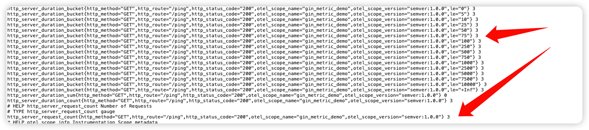

## 背景:

大家好，我是韩数，今天我来填坑了，大概两周前，我在掘金写了一篇 [ Gin 可观测链路实战-集成Trace追踪](https://juejin.cn/post/7392249184122191908)当时规划了两篇文章，今天我们来写第二篇 Metirc 部分。关于 Gin 集成 Metric 的有好几个, 不过大多数虽然能用，但是已经停止更新了, 比如 `gin-prometheus` 和 `gin-metric`这两个开源项目，既然已经有能用的开源的项目了，直接抄他们的代码或者集成那不就好吗？正常而言是这样的，如果只是以会用这个目的，今天这篇文章到这里就已经结束了，但是韩数的学习笔记系列目的不在于此，今天我们将继续延续 Trace 追踪那篇文章的思路，基于 `Opentelemetry` 实现 gin 常用的指标上报关于 `Opentelemetry` 的教程非常少 ，写这篇文章的主要目的也是分享 `Opentelemetry SDK` 的用法，不管阅读量多或者少，希望能给刷到这篇文章的朋友们有所帮助。

关于 Metric 常见指标类型的介绍不在本文的范围，建议没有基础的同学在阅读本文之前至少先看完以下两部分先导内容。

- [凤凰价格可观测性-聚合度量](http://icyfenix.cn/distribution/observability/metrics.html)
- [Prometheus 指标类型介绍](https://prometheus.io/docs/concepts/metric_types/)

本文的目的主要是达到这样一个效果:
- 实现 metric 接口, 完成 http 请求次数，请求延时两个指标的上报，并可以在 promethues 的页面查询到这个指标。

##  👾 初始化一个基本的 Gin 应用

```go
package main  
  
import (  
    "net/http"  
  
    "github.com/gin-gonic/gin"
)  
  
func main() {  
    // Listen and Server in 0.0.0.0:8080  
    r := gin.Default()  
  
    // Ping test  
    r.GET("/ping", func(c *gin.Context) {  
       c.String(http.StatusOK, "pong")  
    })  
    r.Run(":8080")  
}
```

访问浏览器的 `http://127.0.0.1:8080/ping` 确保应用服务是正常的。

## 🪩 自定义指标记录器 `httpMetricsRecorder` 

既然要完成指标上报，各位朋友，我们要做的第一件事是什么，当然是定义这些指标了，还记得我们开头提到的目标吗，我们要完成两个基本指标的上报，分别是:

- 请求次数
- 请求延时

请求次数，仔细思考一下，看起来是一个整数类型(这还用看吗，这不明摆着的吗，写文章也不用这样好吧), 因此请求次数我们使用 `Counter` 类型。而请求延时, 这个一般用`Histogram`类型(这不明摆着吗, 也没别的可以选了好吧), 至于单位吗, 一般我们的接口都很快，通常在毫秒级别，因此为了保证精度，`请求延时` 这个指标我们使用这次`请求开始到结束所经历的毫秒数`。

前置的思考完毕, 现在可以开始真枪实弹写代码了。

### 集成 Opentelemetry 相关的依赖

```bash
go get  "go.opentelemetry.io/otel/metric"
```

### 定义我们的 httpMetricsRecorder

现在开始咔咔写代码:

```go
import (  
    "go.opentelemetry.io/otel"  
    "go.opentelemetry.io/otel/metric"
)  
  
type httpMetricsRecorder struct {  
    requestsCounter       metric.Int64UpDownCounter  
    totalDuration         metric.Int64Histogram  
}  
  
func NewHttpMetricsRecorder(instrumentationName, metricsPrefix string) httpMetricsRecorder {  
    metricName := func(metricName string) string {  
       if len(metricsPrefix) > 0 {  
          return metricsPrefix + "." + metricName  
       }  
       return metricName  
    }  
    meter := otel.Meter(instrumentationName, metric.WithInstrumentationVersion("semver:1.0.0"))  
    requestsCounter, _ := meter.Int64UpDownCounter(metricName("http.server.request_count"), metric.WithDescription("Number of Requests"), metric.WithUnit("Count"))  
    totalDuration, _ := meter.Int64Histogram(metricName("http.server.duration"), metric.WithDescription("Time Taken by request"), metric.WithUnit("Milliseconds"))  
  
    return httpMetricsRecorder{  
       requestsCounter:       requestsCounter,  
       totalDuration:         totalDuration,  
    }  
}
```


在上面这段代码呢, 我们定义了两个类型的 `Metric` 的 `Name` 和 `描述`, 当然这远远还不够，我们还需要定义两个方法来去为这两个指标赋值。也就是，当一个请求来的时候，我们可以为这个 `http_server_request_count` 加一。 

### 定义对应的指标上报函数

```go
// AddRequests 请求开始的时候 调用这个函数为requestsCounter 这个计数器 + 1
func (r *httpMetricsRecorder) AddRequests(ctx context.Context, attributes []attribute.KeyValue) {  
    r.requestsCounter.Add(ctx, 1, metric.WithAttributes(attributes...))  
}  
  
// ObserveHTTPRequestDuration 这里接受一个参数,表示请求的持续时间  
func (r *httpMetricsRecorder) ObserveHTTPRequestDuration(ctx context.Context, duration time.Duration, attributes []attribute.KeyValue) {  
    r.totalDuration.Record(ctx, int64(duration/time.Millisecond), metric.WithAttributes(attributes...))  
}
```

## 📣 开始大干一场吧 
现在指标也定义好了，指标记录相关的函数也写好了，现在立刻，马上给本少爷找地方上报，我要按耐不住我焦热的内心了。那么，在哪里可以记录所有请求的变化呢？ 

此刻正在码字作者本人举手说到🙋‍♂️: 中间件

现在让我们定义一个中间件，和各位读者们的感情都在注释里面了，我先干为敬。

```go

package main  
  
import (  
    "context"  
    "github.com/gin-gonic/gin"  
    "go.opentelemetry.io/otel/attribute"    
    semconv   "go.opentelemetry.io/otel/semconv/v1.25.0"  
    "time"
)  
  
// HttpMetricMiddleware 请求中间件  
func HttpMetricMiddleware() gin.HandlerFunc {  
    ctx := context.Background()  
  
    // 初始化记录器  
    recorder := NewHttpMetricsRecorder("gin_metric_demo", "")  
  
    return func(ginCtx *gin.Context) {  
       // 获取这次请求的完整路径  
       route := ginCtx.FullPath()  
       if len(route) <= 0 {  
          ginCtx.Next()  
          return  
       }  
  
       // 记录请求开始的时间  
       start := time.Now()  
  
       defer func() {  
          // 这里我们定义三个 label, 分别为请求方法和请求路径和状态码  
          attributes := []attribute.KeyValue{  
             semconv.HTTPMethodKey.String(ginCtx.Request.Method),   // 请求方法  
             semconv.HTTPRouteKey.String(route),                    // 请求路径  
             semconv.HTTPStatusCodeKey.Int(ginCtx.Writer.Status())} // 状态码  
  
          // 请求记录器 + 1          recorder.AddRequests(ctx, attributes)  
          // 记录请求的耗时  
          recorder.ObserveHTTPRequestDuration(ctx, time.Since(start), attributes)  
  
       }()  
  
       ginCtx.Next()  
    }  
}

```

在上面这个中间件中我们定义了一些基本的 `label` 并在中间件结束的时候 记录了 `请求数` 和 `请求耗时` 这两个指标。

下一步干什么呢？ 装它，咔咔把中间件装到我们的 gin 应用里面去。

```go
package main  
  
import (  
    "net/http"  
  
    "github.com/gin-gonic/gin"
)  
  
func main() {  
    // Listen and Server in 0.0.0.0:8080  
    r := gin.Default()  
    r.Use(HttpMetricMiddleware())  
    // Ping test  
    r.GET("/ping", func(c *gin.Context) {  
       c.String(http.StatusOK, "pong")  
    })  
    r.Run(":8080")  
}
```

现在让我们再次启动我们的 gin 应用，看看会不会有奇迹发生？ `http://127.0.0.1:8080/ping` 有奇迹发生就说明奇幻发生在你的身上了，这个时候我们只定义了这些指标，但是根本没定义这些指标怎么通过 `http` 的方式暴露出来。大意了。

## 来一场酣畅淋漓的暴露吧

我们需要定义一个  `Opentelemetry` 的 `provider`, 并启动一个 `prometheus` 的服务。

安装依赖(其他的那个缺哪个装哪个吧, IDE自动帮我都装了):

```bash
go get "github.com/prometheus/client_golang/prometheus/promhttp"
go get "go.opentelemetry.io/otel/exporters/prometheus"
```


```go
package main

import (
	"context"
	"fmt"
	"github.com/prometheus/client_golang/prometheus/promhttp"
	"go.opentelemetry.io/otel"
	"go.opentelemetry.io/otel/exporters/prometheus"
	"go.opentelemetry.io/otel/sdk/metric"
	"go.opentelemetry.io/otel/sdk/resource"
	semconv "go.opentelemetry.io/otel/semconv/v1.25.0"
	"log"
	"net/http"
)

func serveMetrics(prometheusPort int64) {
	http.Handle("/metrics", promhttp.Handler())
	if prometheusPort == 0 {
		prometheusPort = 2223
	}
	addr := fmt.Sprintf(":%d", prometheusPort)
	log.Printf("serving metrics at %s", addr)
	err := http.ListenAndServe(addr, nil)
	if err != nil {
		fmt.Printf("error serving http: %v", err)
		panic(err)
	}
}

func initMetrics(prometheusPort int64, serviceName string) {
	metricExporter, err := prometheus.New()
	if err != nil {
		panic(err)
	}

	res, err := resource.New(context.Background(),
		resource.WithAttributes(semconv.ServiceNameKey.String(serviceName)),
		resource.WithSchemaURL(semconv.SchemaURL),
	)
	if err != nil {
		panic(err)
	}

	meterProvider := metric.NewMeterProvider(metric.WithReader(metricExporter), metric.WithResource(res))
	otel.SetMeterProvider(meterProvider)
	go serveMetrics(prometheusPort)

}

```


在 gin 的入口启动 我们的 `provider`
```go
package main

import (
	"net/http"

	"github.com/gin-gonic/gin"
)

func main() {
	// Listen and Server in 0.0.0.0:8080
	r := gin.Default()
	r.Use(HttpMetricMiddleware())
	// 这里这里这里这里看这里
	initMetrics(2233, "gin_metric_name")
	// Ping test
	r.GET("/ping", func(c *gin.Context) {
		c.String(http.StatusOK, "pong")
	})
	r.Run(":8080")
}

```

打开浏览器访问: `http://127.0.0.1:2233/metrics`

有了, 有了，是个男 网页，恭喜各位, 是个男网页 🎉🎉🎉。哈哈哈哈, 当然这个时候还是没有什么值的，让我们访问下:  `http://127.0.0.1:8080/ping` 再刷新下 `http://127.0.0.1:2233/metrics` 不出意外的话应该 不出意外了，



我们请求次数, 延时什么都被准确记录下来了，朋友们可以在页面上多刷几次接口`http_server_request_count`的值应该会符合预期的累增。

### 🀄 总结

真是一场酣畅淋漓的输出啊, 因为要缩短篇幅，因此本文的代码进行了大量的精简，完整的代码可以看[gin-promethues](https://github.com/hanshuaikang/gin-prometheus)这个仓库的实现。所以嘛，应用接入监控指标上报也没有想的那么高深莫测，只需要这样，再这样再那样Pia🐔一下就集成好了，剩下的怎么配置 promthues 和 grafana 仪表盘就不在本文的范围了，不过我相信看到这的读者搞定此事岂不轻轻松松？
