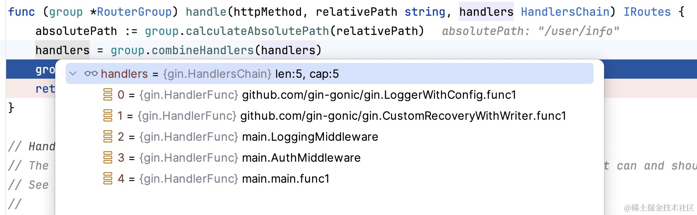

## 前言

在上一篇文章中，我们讲了 gin 相关的路由机制，按照计划，今天这篇文章将会探究 gin 的中间件机制，经常做 web 开发的同学应该对中间件一点也陌生，几乎现代所有的 web 框架都会提供中间件相关的实现， 不论是 django & flask & gin 还是 sping。每种框架实现中间件的思路虽然是不一样的, 但最终大家的目的是殊途同归的，那就是:

> 可以在请求前&后执行一些自定义的通用操作， 例如计算请求时间，注入用户信息，权限校验等等等操作

当然在这里我们要十分注意的是，虽然 gin 的中间件也被称为中间件，但是和通俗意义上大家理解的中间件不是一个东西，搞 java 的同学会听到各种`数据库中间件`，`消息队列中间件`，`API 网关中间件`， 这种中间件更符合 wiki 百科的定义:

> 中间件（英语：Middleware），又译中间件、中介层，是一类提供系统软件和应用软件之间连接、便于软件各部件之间的沟通的软件，应用软件可以借助中间件在不同的技术架构之间共享信息与资源。中间件位于客户机服务器的操作系统之上，管理着计算资源和网络通信。

而我们理解的 gin 中间件，则专门指代 web 框架请求处理的中的 `请求中间件`, 或者为了避免搞混，我们称它为 `请求拦截器` 更加妥当。

## 如何设计一种合适的中间件机制

老规矩，现在让我们忘记 golang，忘记 gin 框架， 忘记自己是一个程序员，现在完全跟随自己的直觉，如果现在让你设计一种中间件，你会怎么设计 ？

在设计之前，我们需要先明确我们设置的中间件的目的， 假设有这样一个场景，我们需要在记录每个请求的执行时间， 再没有中间件的情况下，我们的请求处理流程可能是这样的。


既然中间件， 那这个时候我们就塞一个中间件进去:


这个中间件的作用很简单，收到请求之后， 我先记一下时间，然后才会给请求处理函数， 处理函数执行完，我拿到 response 再去处理一下，再返回客户端:

伪代码的话就类似于下面这样：

```python
def middleware(request):
    start = time.now()
    response = handleFunc(request)
    duration = time.now() - start
    return response
```

所以这里的中间件的作用其实和现实生活中租房遇到的 `中介` 起的是一样的效果， 不信你看下面这张图:


是不是一模一样， 如果有多个中间件，对于我们的处理而言不过在外层 新增一个 for 循环, 下面是伪代码:

```python
def request(req):
    for middleware in middlewares:
        response = middleware(req)
    return response
```

所以 `中间件的 request 和 response 的数据流向是相反的` 可以参考 django 这张经典的图，请求的方向和返回的方向总是相反的，毕竟要 return。


几乎大多数的 web 框架的请求中间件都是这么处理的，我们上面的中间件作用的范围是`全局路由`，有可能我只想某些请求支持中间件怎么办？ 在上一篇文章中，我们讲过 gin 的路由树，我们可以将中间件的作用范围分为两组，一组为全局中间件，一种为作用于某个范围的 `局部中间件`。

到这里，中间件的这种设计思路我们已经讲的大差不差了，现在我们来看看，gin 的实现 相较于我们的设计思路而言有没有什么异同。

## gin 框架的中间件机制实现

在开始之前，为了方便理解， 先让我们准备这样一个实例，该实例有两个 中间件，分别为: `LoggingMiddleware` 和 `AuthMiddleware`。 其中 `LoggingMiddleware` 是全局中间件， `AuthMiddleware` 是局部中间件， 只对 `/user` 这个路由组生效。

```go
func LoggingMiddleware(c *gin.Context) {
	log.Printf("LoggingMiddleware %s", c.Request.URL)
}

func AuthMiddleware(c *gin.Context) {
	log.Printf("AuthMiddleware %s", c.Request.URL)
}

func main() {
	r := gin.Default()
	r.Use(LoggingMiddleware)
	user := r.Group("/user")
	user.Use(AuthMiddleware)
	user.GET("/info", func(c *gin.Context) {
		c.JSON(200, gin.H{
			"name": "h",
			"addr": "深圳",
		})
	})
	r.GET("/", func(c *gin.Context) {
		c.JSON(http.StatusOK, gin.H{
			"message": "Hello, world!",
		})
	})
	r.Run(":8080")
}
```

### 中间件的注册

关于全局中间件， gin 默认会初始化两个中间件，分别是 `Logger(), Recovery()` 。

```golang
// Default returns an Engine instance with the Logger and Recovery middleware already attached.
func Default(opts ...OptionFunc) *Engine {
	debugPrintWARNINGDefault()
	engine := New()
	engine.Use(Logger(), Recovery())
	return engine.With(opts...)
}
```

通过这部分代码，联想到我们使用中间件的方式，几乎可以确定 `Use` 就是注册中间件最核心的方法了。 最终我们看源码会发现, 中间件都是和某个 group 绑定在一起的，而所谓的**全局中间件，本质上就是绑定在了 root RouterGroup 的一组中间件罢了。**

```golang
func (group *RouterGroup) Use(middleware ...HandlerFunc) IRoutes {
	group.Handlers = append(group.Handlers, middleware...)
	return group.returnObj()
}
```

注意看， 代码里面有一个 `append`   从这里我们发现 每个路由组都有一个 `Handlers` 的数组，按照顺序存储了该路由注册下的所有中间件，实际也确实是如此的:

```golang
type HandlerFunc func(*Context)
type HandlersChain []HandlerFunc
```

而 `HandlerFunc` 也就我们的请求处理函数。 从这点看， gin 的中间件本质上和路由处理函数是等价的。在这里我们可以学到gin非常绑定一个设计理念：

`化繁为简，尽量避免复杂的设计`

看过我们上一篇文章的小伙子们，应该都有印象， 按照 httprouter redixtree 路由树的设计，最终我们只会搜索到最终的处理函数，


当我我们在使用前缀树匹配路由时，在上面的案例，假设我们的浏览器输入的地址是: `http://localhost:8080/user/info`的时候

```golang
	user.GET("/info", func(c *gin.Context) {
		c.JSON(200, gin.H{
			"name": "h",
			"addr": "深圳",
		})
	})
```

那我们只能匹配到 /info 这个路由和对应的 handlers， 而 `AuthMiddleware` 和 `LoggingMiddleware` 是绑定在 `/user`, `/`
这些 gourp 上的，难道我们匹配到 /user/info。 我们要向上搜索路由树 `/user` 和 `/`  的中间件， 这样效率显得就太低了，gin 团队肯定不会使用这种设计，实际上，在我们注册 route 的时候，就已经把该路径上会使用的中间件提前处理好绑定在 `/user/info`这个路由下了。

```golang
// 注册 router 的时候就会合并中间件关联到该 router 上，这样通过 redix tree 做查询的时候，
// 就能直接得到该 router 需要 使用的所有中间件列表，大大的加快了效率。
func (group *RouterGroup) GET(relativePath string, handlers ...HandlerFunc) IRoutes {
	return group.handle(http.MethodGet, relativePath, handlers)
}

func (group *RouterGroup) handle(httpMethod, relativePath string, handlers HandlersChain) IRoutes {
	absolutePath := group.calculateAbsolutePath(relativePath)
	handlers = group.combineHandlers(handlers)
	group.engine.addRoute(httpMethod, absolutePath, handlers)
	return group.returnObj()
}

```

在本实例中，handlers 的值，运行的时候就会是这样的:



最终实现handlers 里面的值就是，全局->局部 按照 Use 传入的先后顺序组成的切片， 而我们的请求处理函数则是在最后执行。

### 中间件的处理过程

现在中间件已经注册并绑定到router上了，那执行的时候思路相比也比较明确了。主要有两个步骤:

1.  根据 路由树 查询到 `/user/info `路由实例
2.  依次执行该实例上的 中间件

现在先来看第一步， 主要在gin源码的这个位置.

```go
	t := engine.trees
	for i, tl := 0, len(t); i < tl; i++ {
		if t[i].method != httpMethod {
			continue
		}
		root := t[i].root
		// Find route in tree 主要看这里，看这里，看这里
		value := root.getValue(rPath, c.params, c.skippedNodes, unescape)
		if value.params != nil {
			c.Params = *value.params
		}
		if value.handlers != nil {
			c.handlers = value.handlers
			c.fullPath = value.fullPath
			c.Next()
			c.writermem.WriteHeaderNow()
			return
		}
```

而下面这行代码就是gin中间件处理的核心入口了:

```golang
if value.handlers != nil {
	c.handlers = value.handlers
	c.fullPath = value.fullPath
	c.Next()
	c.writermem.WriteHeaderNow()
	return
}
```

点进去`Next`函数一探究竟,在上一句已经把router绑定的handlers赋值给了context。这里的context是gin的context实例。

```golang
func (c *Context) Next() {
	c.index++
	for c.index < int8(len(c.handlers)) {
		c.handlers[c.index](c)
		c.index++
	}
}
```

这里的`Next`函数很简单，通过索引遍历HandlersChain链条，从而实现依次调用该路由的每一个函数（中间件或处理请求的函数），在本实例中是这样的。


这里注意一下 这里的方法前面使用的是 `c *Context`， 中间件的接收的内容也是 `*Context`， 这就意味着，在任何一个中间件修改了Context, 其他的中间件都可以感知到变化，所以就很方便的可以使用Context提供的`Get`和`Set`方法在中间件/请求函数中传递信息。


如果我们需要在中间件中计算整个请求的执行时间， 我们可以在 中间件内部 调用c.Next()， 如下:

```golang
// RequestTimingMiddleware 是一个 Gin 中间件，用于计算请求的执行时间
func RequestTimingMiddleware() gin.HandlerFunc {
    return func(c *gin.Context) {
        start := time.Now()

        // 处理请求
        c.Next()

        // 计算持续时间
        duration := time.Since(start)
        log.Printf("Request %s %s took %v", c.Request.Method, c.Request.URL.Path, duration)
    }
}
```

为什么可以这么做呢，因为调用了c.Next， 会执行该中间件之后的所有中间件。由于c是指针类型的，因此外层的  
Next由于index已经到末尾了，因此会直接退出循环，而不会造成中间件的重复执行。

``` golang
func (c *Context) Next() {
	c.index++
	for c.index < int8(len(c.handlers)) {
		c.handlers[c.index](c)
		c.index++
	}
}
```

而 跳出中间件.也是通过index变量实现的。

```golang
func (c *Context) Abort() {
	c.index = abortIndex
}
```

大家一定要理解 `index` 在这里面的作用， 这里就可以看出来gin框架能如此流行的原因了,不仅仅是功能简单，在代码设计上也遵循了化繁为简的这个核心原则。


## 总结

到这里本篇文章已经接近尾声了，作为 gin 解密系列的第二篇，关于中间件的部分可讲的实在不多，不过仍然有很多值得我们学习的地方，我是韩数，一个致力于做纯粹分享的技术小白，欢迎各位点赞，关注，收藏，评论。