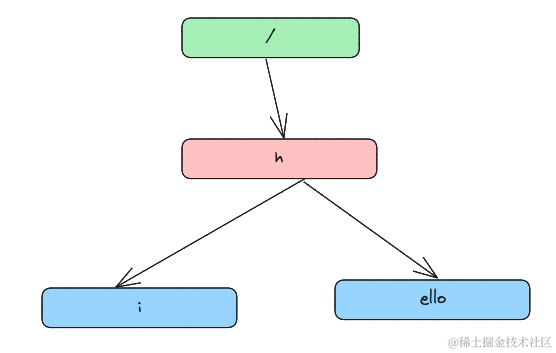

## 前言:

最近因为工作的原因需要用到 Gin 这个框架，由于之前是做 Python Web 开发的，gin 在我的理解中应该和 flask 和 fastapi 这样的轻量级的框架差不多，由于 web 框架设计思路基本上都是类似的，`路由处理`，`异常处理`，`模版渲染` 和 `中间件机制`基本上组成了大多数 轻量级框架的核心功能，于是就没有花很多功夫去了解 gin 的底层实现，直到一个稀疏平常的晚上，我再一次打开 Gin 的中文官方文档，发现了这样一句话:

> Gin 是一个用 Go (Golang) 编写的 Web 框架。 它具有类似 martini 的 API，性能要好得多，多亏了 httprouter，速度提高了 40 倍。 如果您需要性能和良好的生产力，您一定会喜欢 Gin。

当看到 40 倍的性能提升时，我的心里不免有点犯嘀咕，如果只从路由的匹配算法的角度上看，不应该有如此大的性能差距，难道 gin 没有用前缀树而是使用了一种新的数据结构？ 再查阅了一些资料之后，发现 40 倍的性能提升指的是`前端请求-视图函数`整个请求过程的提升，而不是单纯的路由匹配的性能提升(当然也是有的，但是到不了 40 倍的量级)，原因在于 martini 和 gin 设计理念的不同，例如 martini 使用了反射来解析中间件和处理函数&支持依赖注入的特性 本身就带来了一定的性能开销，总不能因为 fastapi 比 django 性能高，就说 django 比较拉垮吧，毕竟两者的设计思路并不一样。

不过既然已经开了这个头，我们就把 gin 的部分设计简单的窥探一番吧，gin 框架解密系列 大概会包含三篇文章, 主要覆盖 gin 的三个特性:

*   路由
*   中间件机制
*   错误处理

本篇作为 gin 解密的 第一篇文章，我们会先忘记 gin 框架这个主题，从 0 开始，不参考任何的技术资料，仅从人类本身的思维出发，我们会如何设计一个路由机制？

## 如何设计一个高效的路由机制

在设计之前，我们需要先想明白这样一件事，路由机制 最最最核心的 作用是什么？

答案很简单：`查找`

我们设计一套路由机制本身就是为了更加高效的查找，路由机制在生活中的运用比比皆是，现在随便找一本书，书的目录是不是一种路由机制？ 或者打开淘宝的地址编辑页面，选地址是不是一种路由查找机制？ 从书的目录和地址级联下拉框可以给我们带来关于路由结构的那些启示？

*   路由具备父子关系，例如 深圳市广州市都属于它的父级: 广东省
*   路由存在一个 根 父极，例如淘宝的配置的跟父极就是 中国

现在让我们动一动脑子，现在不要想任何已有的数据结构和参考实现，纯粹靠自己的直觉，我们会怎么设计一个路由结构，对于我本人而言，它大概长这个样子:


现在我们来模拟一下这个路由查找过程，假设我们现在要查找 `/hello` 这个路由，根据大多数人的直觉，我们的查找路径应该是这样的(红色的线):


这个时候如果我们把 这个类似于书页的 数据结构 向右 翻转 90 度 会发生什么？是不是非常眼熟，变成了一棵 `树` 的结构。



这其实就是 gin 所使用的 压缩字典树 `radix tree`, 来人，给诸位大臣呈上那张被用烂的图。


所以你看，`数据结构本身是人类的思维一种建模，很多数据结构其实我们都在不知不觉中运用很多次了`，既然这个叫做 压缩字典树，那必定是从不压缩字典书进化而来的，不压缩的字典树长这样:


还记得 Mysql 中的 B+ 树这种数据结构吗，在树这种数据结构的查找中，层数越低效率越高。而对于拥有大量公共前缀的字符串，而 URL 路由就存在大量的公共前缀，因此很适合用 radix tree 来存储路由信息。

所以 httprouter 高性能第一个小妙招: `采用 radix tree 压缩路由树，提升查找效率。`

这个时候路由树我们已经通过自己聪明的大脑想出来了，现在还差一步，如何把 gin 的 视图函数 和 路由绑定起来？ 答案是我们需要给 radix tree 新增两个字段，`hasValue` 和 `Value`。 在上图的例子中，由于 h 是 `hi` 和 `hello`的公共前缀，因此 h 是没有值的。


为了让查找更快，radix tree 还额外缓存了下一级的 首字母。这种思路很有效的加速了路由的查询， 类似于下图：


这个时候当我们查询 hello 的时候，根据缓存的首字母 `e` , 马上就可以知道 存在不存在 `hello` 以及 存在的话 在哪个分支上了。

这个时候，我们已经可以通过 radix tree 明白 gin 是如何做路由绑定的了。其实没有大家想的那么复杂。这个时候有其他的同学要说了。

我的脑子: `我会了!`

我的手: `不是，哥们儿？`


现在开始实操环节，如何实现一部分 radix 路由树，之所以实现一部分，是因为在路由匹配的过程中，只会涉及到 radix tree 的查找 和 插入操作。不会涉及到遍历和删除操作，因此为了压缩本文的长度，文末代码部分只会附上 查找 和 插入 的代码。遍历 和 删除大家可以去网上查看相关的资料(不会很难，力扣上很多)。

## 动手基于 radix tree 实现一个最基本的路由系统

我们先来定义 radix tree 的数据结构：

```go
type Node struct {
	// 节点路径
	Path string
	// 是否有值
	HasValue bool
	// 绑定的函数
	Func func()
	// 分支
	Children []*Node
}

type RadixTree struct {
	// 全局 root 节点
	Root Node
}
```

现在大家完全根据直觉，当我想要在下图插入 /hi 的路由时，我们们代码需要做什么工作？


*   第一步 寻找公共前缀，看看已有的各个分支是不是存在 /hi 这条路径，于是我们先匹配第一个节点 `/`, 发现是公共的，于是我们接着 找 / 的下一级，看看有没有 和 `hi`(注意匹配第二级时，要去掉第一级的前缀) 有重叠的，发现 hello 的 h 和 hi 有一个公共前缀 `h`。这个时候你是个正常人，你会怎么做？ 当然是把 h 提出来啊。


这个时候，我们代码需要做的事情什么？

1.  生成一个新的节点 `h`，存储公共前缀，由于它是公共节点，所以它的 `hasValue` 是`false`。`Func` 等于 `ni`
2.  生成一个新的节点，存储 `i`这个字符，并链接到 `h` 的 `children` 中。
3.  生成一个新的节点，存储 `ello`字符，`ello`节点 和`hello`节点的不同之处只是 `path` 去掉了公共前缀。
4.  将 `/` 对应的 `hello` 的分支 指向我们新生成的 `h` 的分支。

变成代码中就是这样：

```go
func (t *RadixTree) Insert(path string, value func()) {
	// 寻找公共前缀，在文中的例子，我们需要先找到 hello 这个节点，已经公共前缀是 /h
	commonPreNode, commonPre := t.FindLongestPreNode(path)
	// 如果发现公共前缀等于 path，说明已经存在这个节点，这个时候直接更新它的值
	if commonPre == path {
		commonPreNode.HasValue = true
		commonPreNode.Func = value
		return
	}

	// 说明有新的后缀
	path = path[len(commonPre):]
	// 遍历每一条分支/可以加缓存优化
	for index, child := range commonPreNode.Children {
		// 如果第一个字符相同
		if child.Path[0] == path[0] {
			// 找到最后一个公共前缀尾部的下标，文中的例子将会找到 h
			i := 0
			for i = 0; i < len(child.Path); i++ {
				if child.Path[i] != path[i] {
					break
				}
			}
			// 生成一个新的节点，path: h
			newChild := Node{Path: path[:i]}
			// 生成子节点，复用 hello 的值，但是 path 变成 ello
			grandson := Node{Path: child.Path[i:], HasValue: child.HasValue, Func: child.Func, Children: child.Children}
			newChild.Children = append(newChild.Children, []*Node{
				&grandson,
				// 生成新的节点，path = i
				{Path: path[i:], HasValue: true, Func: value},
			}...)
			// 修改这条分支指向新节点
			commonPreNode.Children[index] = &newChild
			return
		}

	}

	// 说明没有公共前缀，直接新增
	node := Node{Path: path, HasValue: true, Func: value}
	commonPreNode.Children = append(commonPreNode.Children, &node)
	return
}
```

当然，这个时候如果插入 /gaga 这个路由，因为匹配不到对应的路径，会选择直接插入一个新的节点。

到这里，关于 gin 路由系统的设计理念我们已经大差不差了，本文没有涉及到 gin 的源码，不过设计思路是殊途同归的，当大家理解了最基本的设计思路时，再去看源码就手到擒来了。当然设计上还有细微的差别，例如 在 httprouter 这个库中:

*   每个请求方法类型(GET, POST, PUT, DELETE)对应一颗 radix tree 加快了查找速度。
*   每一级都缓存了下级每个节点的 首字母，加速匹配时分支的判断速度。
*   支持 参数匹配

当然最核心的部分仍然是围绕 radix tree 展开的。

到这里本文就已经接近尾声了，文末附上 我的比较粗糙的 radix 的部分实现，希望能对 读者们 有所帮助。

附:
```go
package main

import "fmt"

type Node struct {
    // 节点路径
    Path string
    // 是否有值
    HasValue bool
    // 绑定的函数
    Func func()
    // 分支
    Children []*Node
}

type RadixTree struct {
    // 全局 root 节点
    Root Node
}

func NewRadixTree() RadixTree {
    return RadixTree{Root: Node{Path: "", HasValue: false, Func: nil}}
}

func (t *RadixTree) FindLongestPreNode(path string) (*Node, string) {
    if len(path) == 0 {
            // 说明没有最长公共前缀
            panic("Path cannot be empty")
    }
    node := &t.Root
    commonPre := ""

    index := 0
    // 记录公共前缀
    for {
            if index >= len(node.Children) {
                    break
            }

            child := node.Children[index]
            if child.Path == path {
                    commonPre = path
                    return child, commonPre
            }

            if len(child.Path) < len(path) && child.Path == path[:len(child.Path)] {
                    commonPre += child.Path
                    node = child
                    path = path[len(child.Path):]
                    index = 0
                    continue
            }

            index += 1

    }

    return node, commonPre

}

func (t *RadixTree) Insert(path string, value func()) {
    // 寻找公共前缀，在文中的例子，我们需要先找到 hello 这个节点，已经公共前缀是 /h
    commonPreNode, commonPre := t.FindLongestPreNode(path)
    // 如果发现公共前缀等于 path，说明已经存在这个节点，这个时候直接更新它的值
    if commonPre == path {
            commonPreNode.HasValue = true
            commonPreNode.Func = value
            return
    }

    // 说明有新的后缀
    path = path[len(commonPre):]
    // 遍历每一条分支/可以加缓存优化
    for index, child := range commonPreNode.Children {
            // 如果第一个字符相同
            if child.Path[0] == path[0] {
                    // 找到最后一个公共前缀尾部的下标，文中的例子将会找到 h
                    i := 0
                    for i = 0; i < len(child.Path); i++ {
                            if child.Path[i] != path[i] {
                                    break
                            }
                    }
                    // 生成一个新的节点，path: h
                    newChild := Node{Path: path[:i]}
                    // 生成子节点，复用 hello 的值，但是 path 变成 ello
                    grandson := Node{Path: child.Path[i:], HasValue: child.HasValue, Func: child.Func, Children: child.Children}
                    newChild.Children = append(newChild.Children, []*Node{
                            &grandson,
                            // 生成新的节点，path = i
                            {Path: path[i:], HasValue: true, Func: value},
                    }...)
                    // 修改这条分支指向新节点
                    commonPreNode.Children[index] = &newChild
                    return
            }

    }

    // 说明没有公共前缀，直接新增
    node := Node{Path: path, HasValue: true, Func: value}
    commonPreNode.Children = append(commonPreNode.Children, &node)
    return

}

func (t *RadixTree) Find(path string) (bool, *Node) {
    if len(path) == 0 {
            return true, &t.Root
    }

    node := &t.Root
    index := 0

    for {
            // 如果下标超出了 分支的个数，则说明没有找到，退出
            if index > len(node.Children)-1 {
                    break
            }
            child := node.Children[index]
            if child.Path == path {
                    return true, child
            }

            // 如果子树存储的path 小于要搜索的，说明要去下一层去搜索, 并且有公共前缀
            if len(child.Path) < len(path) && child.Path == path[:len(child.Path)] {
                    node = child
                    path = path[len(child.Path):] // 截取公共前缀后面的部分
                    index = 0
                    continue
            }

            index += 1

    }

    return false, nil
}

func (t *RadixTree) print(node *Node, fullPath string) {
    if node == nil || len(node.Children) == 0 {
            return
    }

    for _, n := range node.Children {
            fullPath += n.Path
            fmt.Println(fmt.Sprintf("fullPath: %s, nodePath: %s, HasValue: %v, Value:%v", fullPath, n.Path, n.HasValue, n.Func))
            t.print(n, fullPath)
            fullPath = fullPath[:len(fullPath)-len(n.Path)]
    }

}
```

运行:

```go
package main

import "fmt"

func main() {
	radixTree := NewRadixTree()
	radixTree.Insert("/", func() {
		fmt.Println("root")
	})
	radixTree.Insert("/hello", func() {
		fmt.Println("/hello")
	})
	radixTree.Insert("/hello/aa", func() {
		fmt.Println("/hello/aa")
	})
	radixTree.Insert("/hallo", func() {
		fmt.Println("/hallo")
	})
	ok, node := radixTree.Find("/hello")
	if ok {
		node.Func()
	}
}
```
