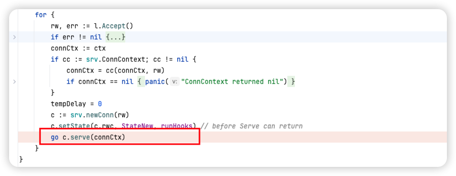
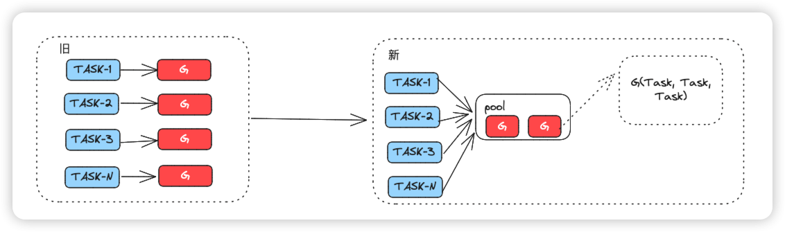
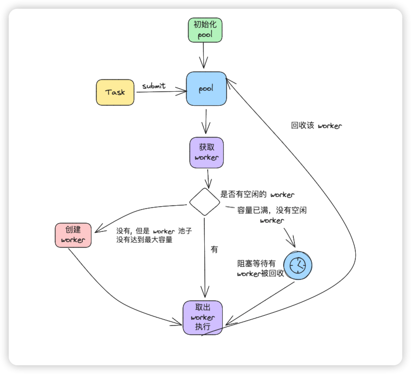
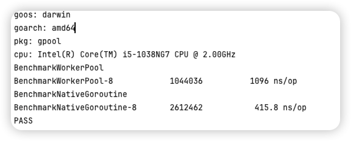
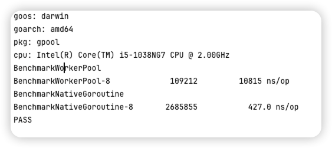
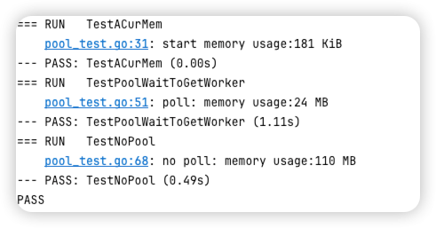
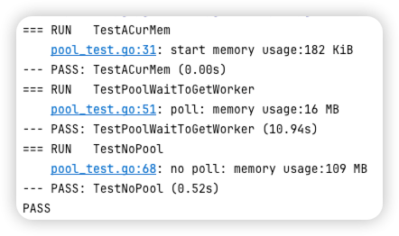

# 100 行代码用 Go 实现一个可复用 Go Routine 池

大家好，我是韩数，最近也学习了不少东西，Rust 和 看了一些 Golang 的书籍，鉴于 GMP 并发模型已经有写的非常好的博客，大家可以看下面这篇文章。

[Golang三关-典藏版 Golang 调度器 GMP 原理与调度全分析](https://learnku.com/articles/41728)

上面这篇关于 GMP 模型的文章写的十分详细，因此怎么想我也没有写一篇重复博客的必要了。不过看本文之前还是建议先看看上面这篇关于 GMP 的好文，更加容易理解为什么在某些情况下我们可能会需要一个 **可复用** GoRoutine 池。

首先声明一下, 本文的代码并不适用于生产环境，生产环境有 ants 这类更加完善的库，初衷则是聚焦于 **可复用** 这个概念。当我们了解一个只具备基础功能的可复用GoRoutine 池是怎么样工作的，对于 ants 这样一些优秀的开源框架才会有一些些思路，看他们的源码也会更加容易些。至少在用的时候也不会知其然而不知所以然了。

## 为什么在某些情况下我们可能会需要一个 可复用 GoRoutine 池？

在《深入理解 Go 语言》这本书中，有一个非常重要的结论，那就是:

即使 GoLang 提供了像 Go Routine 这样的轻量级运行时，我们仍然不能无限制的创建它。迅速地开辟Goroutine 且不控制并发 Goroutine 的数量，会在短时间内占据操作系统的资源（CPU、内存、文件描述符等。最终因为内存占用不断上升导致主进程崩溃。

这就告诉我们一个道理，**不管有多少钱也经不住随便嚯嚯。**

超大规模并发的场景下,  不加限制的大规模的 goroutine 可能造成内存暴涨，给机器带来极大的压力，吞吐量下降和处理速度变慢还是其次，更危险的是可能使得程序 crash。想象一下现在有一个 http 的 Web 服务,  突然拥入 100 万的请求，golang 的 web 一般都是基于 net/http 库实现的，net/http 的代码中每来一个新的请求都会起一个单独的 goRoutine 去执行它。具体代码在这里:



既然不受限制数量的 Go Routine 会导致内存占用不断增长引发灾难，那么解决问题的思路就会变得非常简单:

**那就是减少系统中正在运行的 Go Routine 数量。**

为了方便，接下来会统一使用 G 来指代 **Go Routine**



旧的方式，一个 Task 占用一个 G 去执行，类似于下面这种方式:

```go
func task() {
	fmt.println("111")
}

go task()
```

而新的方式的核心逻辑其实就是让一个 **G 可以运行多个 Task，以达到复用的目的**，假设我们有 100 固定数量的 Task,  比较蠢的办法就是每个 G 分配十个 task 去执行，类似于下面这样:

```go
go func(){  
    for _, task := range tasks[0:10] {  
       task()  
    }  
}
```

这样原本有需要 100 个 G 才能执行完这 100 个 Task，现在只需要 10 个, 当然你过分点, 1 个也是可以做到的。当然，你这么跑 100 个 Task 肯定没有直接起 100 个 G 运行的快。所以 

**Go Routine 池本身是时间换空间, 以牺牲一定的并发性能为代价，避免内存的无限制增长导致的灾难。**

## Go Routine 池执行流程图



##  现在可以开始编写我们的代码了。

在上文中，我们用了一个非常挫的方式实现了 G 的复用，但是现实世界中，task 的数量并不是一开始就决定好的，因此我们换上正规军装备，使用 go channel 实现对于 Task 的获取。

### Worker

当然，在实现这一切之前，我们需要先定义一个 Worker:

worker 的逻辑异常简单，大概只需要不到 30 行代码:

```go
package main  
  
type Worker struct {  
    task chan fn  
    pool *Pool  
}  
  
func (w *Worker) Run() {  
    go func() {  
       for t := range w.task {  
          // 退出机制，本文不会涉及  
          if t == nil {  
             // 正在执行的数量 -1
             w.pool.decRunning()  
             return  
          }  
          t()  
          // 执行完了将该 worker 重新放回池子里  
          w.pool.putWorker(w)  
       }  
    }()  
}
```

Worker 主要有以下两部分组成:
- task 一个 channel 用于接收任务
- pool: 所属的 G 池子对象。

### Pool

你现在是一个养鱼的塘主，鱼塘对你而言最重要的东西是什么？

鱼啊，现在有多少鱼，已经我这个鱼塘最多可以养多少条鱼。

天下大池小池殊途同归，对于 Go Routine 池也是这样的。

```go
type fn func()  
  
type Pool struct {  
    // 正在运行的 worker 数  
    running int64  
    // worker 列表  
    workers []*Worker  
    // worker 数量  
    capacity int64  
    // 锁  
    lock sync.Mutex  
}
```

实现一些最基本的公共方法:
```go
// 正在执行的数量 + 1
func (p *Pool) incRunning() {  
    atomic.AddInt64(&p.running, 1)  
}  
// 正在执行的数量 - 1
func (p *Pool) decRunning() {
	running := atomic.LoadInt64(&p.running)
	// 防止缩容的时候被打穿
	if running == 0 {
		return
	}
	atomic.AddInt64(&p.running, -1)
}

// 正在执行的数量
func (p *Pool) Running() int64 {  
    return atomic.LoadInt64(&p.running)  
}  

// 创建一个池子
func NewPool(capacity int64) *Pool {  
    return &Pool{  
       capacity: capacity,  
       workers:  make([]*Worker, 0),  
       running:  0,  
    }  
}

func (p *Pool) putWorker(worker *Worker) {  
	// 加锁，防止同时有 worker 被回收
    p.lock.Lock()  
    p.workers = append(p.workers, worker)  
    p.decRunning()  
    p.lock.Unlock()  
}  
  
func (p *Pool) SubmitTask(task fn) {  
	// 获取到一个 worker
    worker := p.GetWorker() 
    // 正在执行的数量 + 1 
    p.incRunning()  
    // 发送任务
    worker.task <- task  
}

```

Pool 最核心的方法主要有一个:

- 从 池中 获取一个可用的 worker,  在本例中实现比较简单
```go
func (p *Pool) getWorker() *Worker {  
	// 加锁，防止获取到同一个 worker
    p.lock.Lock()  
    defer p.lock.Unlock()  
	// 如果当前 worker 数量大于 1, 说明有空闲的，直接使用
    if len(p.workers) > 0 {  
       worker := p.workers[len(p.workers)-1]  
       p.workers = p.workers[:len(p.workers)-1]  
       return worker  
    }  
    // 走到这里说明当前没有空闲的 worker，所有的 worker 都在跑
    // 如果正在运行的数量小于容量，说明 worker 的总数量 小于容量，直接开启一个新的 worker
    if p.running < p.capacity {  
       worker := &Worker{  
          pool: p,  
          task: make(chan fn),  
       }  
       // 启动这个新 worker
       worker.Run()  
       return worker  
    }  
  
    for {  
	   // 说明 worker 数量达到最大限制, 陷入等待，当然也可以做成异步的
       p.lock.Unlock()  
       time.Sleep(time.Millisecond)  
       p.lock.Lock()  
	   // 等到了空闲的 worker，取出来执行
       if len(p.workers) > 0 {  
          worker := p.workers[len(p.workers)-1]  
          p.workers = p.workers[:len(p.workers)-1]  
          return worker  
       }  
    }  
}
```


没了，加起来去掉注释不超过 100 行代码，当然，这只是 **可复用GoRoutine** 最核心的部分，做到一个生产级别的 GoRoutine 池子需要非常多额外的工作，基于上述 的 Pool, 最少缺少了:
- 类似于 WaitGroup 的 wait 机制，对于任务数可知的场景，需要等到所有的任务执行完。或者新任务数逐渐降低, 池子是不是可以自动扩缩容，ants 采用了周期回收的策略，worker 里面那句 if task \=\= nill。就是用来做 worker 的回收的。
- 优雅的退出机制，如何优雅的关闭所有的 worker 并退出。
- 是否运行提交的 task 带参数。
- 是否允许异常的任务自动重试，直到达到最大重试次数。
- 允许动态调整池的大小
- ......

对于上述的特性很大一部分都可以在 ants 的库的代码中找到，本文不会很深入去介绍这部分，感兴趣的可以去看 ants 的 源码，传送门:

https://github.com/panjf2000/ants


## 测试阶段

现在一个异常捡漏的 Go Routine 池子已经完成了，现在我们可以写一下基本的BenchMark。

### 性能测试

当  Pool 池子的大小为 1w 时，执行200w+次，每次个任务执行大概 10ms 的时间。

不使用 Pool 大概比 使用 Pool 的性能高三倍。


如果我们把池子的大小设置成 1k. 使用 池子的性能就会极速下降。本质上 **池化是在抑制病发**。



此时的性能差距来到了 23 倍。

## 内存测试

运行 100 w 个任务，有 pool 和 无 pool 执行前后的内存变化，这个测试不是十分严谨，我们取十次，取平均值。

部分测试截图:

任务 100w, pool 的容量为 1w:


任务 100w, pool 的容量为 1k:



多次执行取平均值大概结论:  
- 100w 个任务的量级下，设置 pool 池的容量为 1w。使用 GoRoutine 池的内存占用只有原生的 22%
- 100w 个任务的量级下，设置 pool 池的容量为 1k。使用 GoRoutine 池的内存占用只有原生的 14%

去除误差，仅仅从逻辑上计算，由于 G 的数量指数级减小，内存的占用也会相应直接减下来。


## 总结

写到这里我们已经实现了一个非常基础的 Go Routine 池。当然实现并发控制的方式远不如这一种。
比如也可以使用带缓冲区的 channel 完成并发控制:

```golang
func main() {
	ch := make(chan struct{}, 3)
	for i := 0; i < 100; i++ {
		ch <- struct{}{}
		go func(i int) {
			time.Sleep(1 * time.Second)
			fmt.Println("i: ", i)
			<-ch
		}(i)
	}
}

```

因此在决定是否使用 Go Routine 池子之前，最好需要先评估是否并发规模已经达到了需要控制的程度？如果平常只有几万个并发，内存占用
上升也不那么明显的情况下，使用 Go Routine 池子复用反而会降低程序的处理性能。


      


