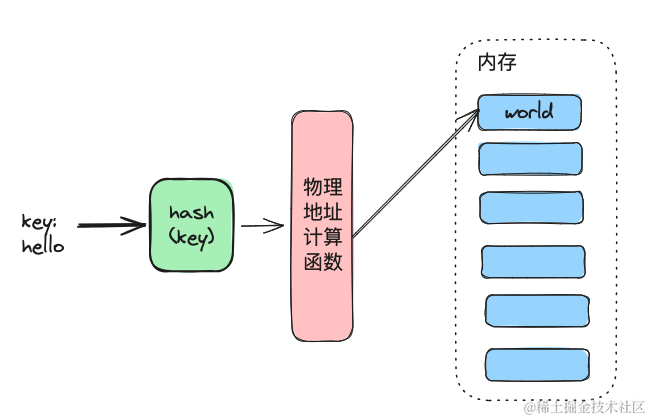

文章的开头，`求赞，求收藏, 求关注`，图解系列专栏所有文章不会有任何第三方平台的引流&广告，纯粹的技术分享为主，感兴趣的话可以关注下专栏，我会尽量保持每周一篇的更新速度。掘金专栏地址: [图解系列](https://juejin.cn/column/7356240651041030159 "https://juejin.cn/column/7356240651041030159")

还记得专栏的第一篇文章讲的是一致性Hash,  没想到第三篇文章又是和 hash 有关，因为工作的原因需要从 Python 转到 Go，还记得之前看了一本《Go语言精进之路》 里面有提及到一点Go Map 的实现，当时看的也是云里雾里，互联网上讲清楚的博客也不是很多，还有一些是从汇编源码角度去进行分析的，思来想去，决定自己写一篇博客放到图解系列里面来，本文汇编&源码涉及的较少一些，主要以设计思路为主，毕竟源码相关的东西看了也容易记不住。思路理解清晰了再回去看源码就相对来说比较容易一些了。

## Map 的定义

再讲 Go Map 的实现之前，我们先来聊一下 Map 的定义是什么，我们会发现，基本在所有的编程语言中尽管实现的思路各有不同，但是对外所提供的功能都是一致的:

`一个存储了 key:value 键值对的数据结构，其中Key是唯一的，不同的 key 可以对应相同的 value`

基本上看到这个定义的同学马上就能联想到一种数据结构可以实现上述的功能，那就是: `hash(哈希)`，这依赖了Hash 算法的一个非常重要的特性:

`hash 算法有一个最核心的特点:  对同一个关键字进行哈希计算，每次计算都是相同的值`

我们可以把 hash 计算的结果通过一定的方式转换成物理地址，把对应的 value 存储到该物理地址下，这样就完成了一个最最基础的 map 的实现:


这么一看貌似没什么问题，但是我们忽略了一个非常重要的问题，那就是 `hash 碰撞`，一般解决 hash 碰撞的思路主要有以下两个:

*   链表法: 也叫拉链法，顾名思义就是把发生冲突的 key 的 value 组成一个链表。
*   开放地址法  则是碰撞发生后，通过一定的规律，在数组的后面挑选“空位”，用来放置新的 key。

这里我们主要说链表法，毕竟 go 语言解决冲突的方式就是链表法，因为开放地址法在冲突频繁的时候会带来比较大的时间损失，所以不太适合作为编程语言底层 map 解决冲突的方式，传统的链表法是这样的:


在上图 `1` 和 `6` 发生了冲突，于是以 1 和 6 作为链首向后追加链表。如果需要使用 `链表法` 来解决我们上述那个潦草 map 的冲突解决方式，上图需要调整成这样，也就是我们 map 的数据结构不能只包含 value 了，应该包含 key: value 的键值对，这样发生冲突时才能知道对应的 value 是属于哪个 key 的。如下图所示:


现在我们来总结一下一个 `map<key:value>` 的数据结构应该具备哪些基础的操作:

*   **插入**: 我们的 key 通过地址映射的方式插入元素，hash 冲突的时候可以通过链表法插入新元素。
*   **删除**: 只需要定位到元素的位置删除该元素就可以了。
*   **编辑**: 定位到元素，修改 对应 value 就行。
*   **查找**: 定位到相关的元素即可。
*   **遍历**: 我们可以在我们的 map 内部维护一个数组，记录 map 下所有的 key 即可实现遍历。

这么回过头向上看`我擦`还挺完美的是不，建议 go map 直接采用我们的这套实现方案。每篇文章必备词语: `出院！`

实际的 map 要比 上述的方案复杂的多的多得多，接下来上正餐，来看看 go 这种优秀的编程语言是如何实现 `map<key:value>` 这种数据结构的。

接下来的文章会非常长，建议各位大哥耐心看完:

## Go map 的数据结构

是时候祭出这张经典的图了


怎么样，是不是发现我们的上面那个基础版本的 map 有异曲同工之妙，我们先不用管  go 语言 map 是怎么实现的，只看这张图我们能得到的信息有三个:

*   go 的 map 实现在 `hmap` 这个数据结构里面，`hmap` 存储了个 `buckets` 用于存储所有的`bucket`
*   go `bucket` 是一个存储 key, value 数据的数据结构，其中 key 放一块儿，value 放一块儿。
*   go 采用冲突解决的办法是 链地址法，每个 bucket 下有一个 overflow 属性用于指向其他的 bucket

数据怎么存我们知道了，map 怎么决定一个 key 的  value 存在哪个 buckets 呢？ 朋友们，大声喊出你们的答案:  hash(哈希)

### 关于上述第二点 go 的 map 为什么 key 放一块，value 放一块的额外补充。

go 为什么这么设计呢？ key, value 放一块多好，为什么非要拆散他们呢？ 答案其实很简单，为了节省因为内存对齐而造成的内存浪费：

由于操作系统是根据 `块` 为单位从 内存中 读取数据的，`块` 的大小是 2 的平方倍，如果 key 和 value 放一块存的话，就需要额外 padding 一块 7 个字节的空间方便操作系统的读取，存储的效率就会下降很多。


### Go map 的 Key 定位过程

还记得我们之前讲过的 hash 的函数的定义吗，**对同一个关键字进行哈希计算，每次计算都是相同的值**

在我们图解系列第一篇 [一致性Hash](https://juejin.cn/post/7356240651041046543) 那篇文章有提到，hash 计算的结果是一个整数，在 64 位机器上就是 64 个比特值，在 32 位机器上就是 32 个比特值，看图说话：


go 根据 key 计算出来这个 hash 值之后呢？

**后B位**: 会取 这个 64 比特的 hash 的后 B 位，**千万要记住这个 B**，在上述的图中, 这个 B 是 5, 然后决定放到哪个 bucket 里面，在B = 5 的情况下，那就是 2 的 5 次方，可以支持 32 个 bucket。

注意看，这个男人叫小帅，咳咳，注意看，前面有8 位也被框出来了，前面的八位用于定位 key 在某个 bucket 中 的 位置，注意啊，老铁，这并不意味着一个 bucket 可以存放 2 的 8 次方，256 的 key。一个 bucket 只能装 8 个 key , 这个是源码上限制的:

```go
type bmap struct {
    topbits  [8]uint8
    keys     [8]keytype
    values   [8]valuetype
    pad      uintptr
    overflow uintptr
}
```

接下来我们来看一下 详细 bucket 的数据结构，让我们康康:


注意看，每个 Bucket 除了存储 key, value 以及指向下一个 bucket 的 overflow指针之外，还有 8 个 TopHash 的位置，当 Bucket 为空时，当第一个 key 添加到该 bucket 时，第一个 key 的 tophash 就会存储到第一个 tophash 的位置，key 也会存到第一个 key 的位置，后面的 key 依此类推。当 bucket 存储了 8 个 key 时，此时就会起一个新的 bucket 进行存储，并把该 bucket 的 overflow 指针指向新创建的 bucket.  如下图:


查找的时候同理，看下图：

1. 根据 该 key hash 的后 **B(5)** 位，我们得到了 **00110**, 换算之后是数字 **6**, 于是我们路由到了第 6 个 bucket。
2.  根据 hash 的前 8 位，换算之后得到 151，通过查找 tophash 我们发现在 3 号位置上。于是得出 key 的位置是 3，value 的位置 也是 3，这样我们就获取到了该 key 对应的 value 的值。

如果第一个 bucket 还没有找到，就会沿着 overflow 的指针继续找下一个 bucket，直到找到该 key 位置。


这个时候有机智的同学就要问了，如果假设我是说假设极端情况下，所有的 key 的后 B 位 全部都一样，假设有1000 个 key, 后 B 位全是 `00110` 的话，那岂不是只会命中同一个第一级 bucket 上，这个时候 map 岂不是就会退化成链表了？ 确实是会出现这个问题的, 不过我提醒你如果有一天让你给碰上了，记得一定要记得买张彩票。

虽然上面的极端情况我们几乎不可能会碰到，但是如果我们在一段时间内插入了大量的 key，这些 key 也冲突了一部分，导致我们每个 bucket 后面都有一个长长的 bucket 链表，这个时候我开始删元素了，删了非常多，这个时候我们上面的图就会变成下面这样：


由于我们删掉了大量的 key，导致原本装的满满的的 bucket 一个个都空了，但是 bucket 的数量 并没有减少！只是 出现了 大量 空位。这个时候假设我们倒霉，需要访问 上图中 代表 `紫色心情` 的 key，我们仍然需要沿着 bucket 找下去才能找到它。这就带来了一定的性能下降，后面讲 map 扩缩容的时候我们会详细讲到 go 如何解决这个问题的。

写到这里,  go 的 map 几个操作已经明白儿的透透的了。我们现在来总结下:

*   **新增操作**:  经过计算之后路由到合适的 bucket，然后根据插入到 bucket 对应的位置上。
*   **查询操作**:  通过后 B 未计算到目标 bucket，在通过前 8 位 topHash 定位到该 bucket 中的 key 和 value 的位置。如果该 bucket 未找到，则沿着 overflow 指针向后找，直到找到为止。
*   更新操作: 通过后B位计算到目标 bucket，再通过前 8 位 topHash 定位到该 bucket 中的 key 和 value 的位置，然后更新 value 的值。如果该 bucket 未找到，则沿着 overflow 指针向后找，直到找到为止。
*   删除操作: 定位到 key 和 value 的位置之后，将 key 和 value 进行清除，在代码里面是赋值为 nil。

这些操作往往还会伴随着一些额外的操作，比如将 map 数据结构的 count 更新等等，不过这些不是本篇文章的重点，这里就不详细展开了。

现在关于 map 的增删改查的思路我们通过上面的一通操作已经基本算是了解了，现在我们还差一个，那就是 map 的遍历，由于 map 的遍需要先了解map 扩容 和 等值扩容 的操作，所以我们需要先了解 map 的扩缩容操作。

## Map 的扩容 和 等值扩容

现在我们不依赖于任何博客和文档，完全依靠我们的直觉，一般当出现什么样的情况的时候，我们才需要考虑对 map 进行扩缩容的操作呢？

什么时候我们需要扩容呢？ 那必然是存储空间不够的情况下，什么时候需要缩容呢？ 一般是空置率太高的情况下我们需要缩容。

不过需要强调的是，`这里 map 的缩容并不意味着 B 的值会变小，而主要目的是消除过多的控制的 overflow bucket，使我们的 map 变得紧凑起来，所以也叫等值扩容。`

针对于 map 的`扩容` 和 `等值扩容` ，在 go 的实现里面对应如下两个条件。

### 扩容:

既然扩容是基于存储容量不够这样的一个前置条件，那我们就需要一个衡量存储容量使用率的标准，在 go 的实现里面，这个标准叫做 `装载因子`。

装载因子的计算方式如下:

```bash
元素的数量/bucket 数量
```

每个 bucket 能存储的 key 的个数是 8，如果所有的 bucket 都存满了，这个时候假设 map 中总共有 80 个 key，一共有 10 个 bucket，那么装载因子就是最大值 80/10 = 8。在 go 的实现中，装载因子大于 6.5 的时候就会触发扩容，用大白话说就是 map 中大多数的 bucket 都快被装满了情况下，就会触发扩容，这是符合人类的逻辑的。

go map 是如何扩充 bucket 的数量呢？ 答案是直接翻 2 倍，这个时候有同学要问了，为什么是翻 2 倍，而不是三倍，五倍呢？ 还记得我们的 bucket 的数量是如何确定的么？ 根据 hash 值的 后 B 位，扩容的时候我们只能增加B的大小，那自然就会多 2 倍了.B = 5 时，2 的 5 次方为 32，B = 6, bucket 的数量就会变成 2 的 6 次方 64 个。

但事情看起来没有那么简单，我们忽略了一个最重要的问题，假设 B=5，我们原来需要根据后 5 位去得出数据将会存储到哪个 bucket，现在 B=6，多了一位，多出来的一位有两种情况: 0 和 1。也就是我们之前的一个 bucket 中的 key，进行重新计算之后会被分散存储到两个新的 bucket 上面去。


假设我们之前的两个 key 的 hash 后 5 位 分别为 `01001`, `01001`, 由于 hash 的后 B 位相同，所以这两个 key 被分配到了同一个 bucket 上，现在兄弟们，我们要扩容了，此时 `B+1=6`,原来这两个key 的后五位相同，但是并不意味着 后 6 位相同。 此时两个 key 的后 6 位变成了 `101001`, `001001` 由于 B 值的大小的变化，此时他们已经不会被分配到同一个 bucket 里面了，此时一个 bucket 的元素 就会分裂到两个 bucket 里面存储。


如何确定某个旧的bucket 中的 key 存储到哪个新的 bucket 呢？ 没有什么好的办法，将 key 根据后 B+1 位重新计算一遍，大多数人已经看出来了，重新计算是比较费性能的，如果有大量的 key/value 都需要搬迁，那么就会很容易影响性能，所以 go 采取了一种 `渐进式的` 迁移方式，即每次只迁移 2 个 bucket。注意这里的迁移不仅仅是迁移第一层的 bucket，bucket overflow 后面连的那一串 bucket 都会被迁移。


那什么时候会触发某个 bucket 的迁移呢？ 答案是 插入或修改、删除 key 的时候，都会尝试进行搬迁 buckets 的工作，直到我们把所有的 bucket 迁移完。

现在我们回过头来回顾一下 map 的定义:

当扩容开始时，会先将旧的 bucket 挂到 `oldbuckets` 上，再在 `buckets` 字段指向新的扩容之后的 bucket, 当所有的 bucket 都迁移到新的 bucket 上的时候，oldbuckets 的值就会变成 nil。针对源码部分我们点到即止，需要详细了解的可以看文末的参考资料。

```go
type hmap struct {
    // 元素个数，调用 len(map) 时，直接返回此值
	count     int
	flags     uint8
	// buckets 的对数 log_2
	B         uint8
	// overflow 的 bucket 近似数
	noverflow uint16
	// 计算 key 的哈希的时候会传入哈希函数
	hash0     uint32
    // 指向 buckets 数组，大小为 2^B
    // 如果元素个数为0，就为 nil
	buckets    unsafe.Pointer
	// 等量扩容的时候，buckets 长度和 oldbuckets 相等
	// 双倍扩容的时候，buckets 长度会是 oldbuckets 的两倍
	oldbuckets unsafe.Pointer
	// 指示扩容进度，小于此地址的 buckets 迁移完成
	nevacuate  uintptr
	extra *mapextra // opt
```

到这一步我们关于 map 的扩容操作的基本思路就讲清楚了，核心的概念就是：`循序渐进式的搬家`。

现在我们来看一下等值扩容：

### 等值扩容

根据我们前面提到的，既然装载因子过高说明 bucket 都快装满了，需要扩容，那么装载因子过低，说明 bucket 空置率太高了，因此我们需要进行适当的调整，在 go 的实现中，装载因子小于 1 的时候会触发 bucket 的缩容操作。至于造成这种空置率过高的原因我们上文也有提到：

如果我们在一段时间内插入了大量的 key，这些 key 也冲突了一部分，导致我们每个 bucket 后面都有一个长长的 bucket 链表，但是装载率保持在 `1< 装载因子 < 6.5` 的水平，然后我们开始疯狂删元素，这个时候就造成了我们的 bucket 的数量很多，但是闲置率很高。这个时候有的朋友说了，这不是炒房的结果吗？ 跑题了哈哈哈哈。


这个时候我们的 map 就变成了这样，如果我们需要找最后一个紫色心情的 key，那效率就很低了。所以才需要 bucket 的等值扩容， 针对 overflow 的修剪操作。


由于在这种情况下，由于我们的 B 的大小是不变的，因此我们就不需要对 bucket 中的 某个 key 重新计算，所以我们的 key 直接搬到新的相同序号的 bucket 就可以了。


这样一来闲置率就下去了，自然查找效率就高起来了。


## 遍历

现在摆在我们面前的就只剩最后一座大山了，`map 的遍历操作`，为什么一定要讲完扩容再讲遍历呢，答案是 我们在 遍历的过程中会遇到一些有趣的现象，这个和 go map 的扩缩容操作是离不开的。

这个时候可能又又又有人要问了：

map 的遍历不是一个小意思吗， 我只需要遍历 go map 的 buckets 字段，拿出所有的 key，value，然后再沿着 overflow 遍历一遍，这事儿不就 ok 儿了吗？

但是哥们儿，你忽略了一个问题，那就是 map 的扩缩容操作带来的影响，扩缩容的时候一部分 key 还在 老的  oldbuckets 里面，一部分在新的 buckets 里面，这个时候怎么遍历呢？

我知道，同时遍历两个！ 天才，我之前也是这么想的，不过很可惜，我们都错了。

首先因为扩缩容的原故，map 的 key 所处的 bucket 会一直改变，因此如果我们对 map 进行遍历，那么我们得到的 key 的顺序和我们的插入顺序是不一致的，但是如果我们刚开始声明了 map 的大小，插入的 key 的数量并不会触发扩容，那么我们遍历 map 的 key 输出是有序的吗？ 答案仍然是无序的。

**go 的设计者为了避免开发者误认为 map 的遍历是有序的，所以每次遍历 map 的时候会随机从某个 bucket 开始**。 选择的算法是这样的，看不懂也没关系，下面我会讲思路:

```go
:= uintptr(fastrand())
if h.B > 31-bucketCntBits {
	r += uintptr(fastrand()) << 31
}

// 从哪个 bucket 开始遍历
it.startBucket = r & (uintptr(1)<<h.B - 1)
// 从 bucket 的哪个 cell 开始遍历
it.offset = uint8(r >> h.B & (bucketCnt - 1))
```

不是很懂位运算的朋友也不需要理解上面那段代码的意思，只需要知道上面的代码每次会生成一个如下的遍历顺序就可以了，假设我们有 4 个 bucket，startBucket 的值是 3，那么遍历的顺序就是:

```bash
[3,0,1,2]
```

也就是先遍历 3 号  bucket，再回去遍历 0, 1, 2 号 bucket，以此类推，直到遍历到 bucket 3，那就说明遍历一轮了。

假设我们有下图所示的一个 map，起始时 B = 1，有两个 bucket，后来触发了扩容，B 变成 2。并且， 1 号 bucket 中的内容搬迁到了新的 bucket，`1 号`裂变成 `1 号`和 `3 号`；`0 号` bucket 暂未搬迁。老的 bucket 挂在在 `*oldbuckets` 指针上面，新的 bucket 则挂在 `*buckets` 指针上面。


经过上述的计算得到 `startBucket = 3` 和 `offset = 2`, 于是会随机从 3 号 bucket 的 2 号位置进行遍历如下图:


由于 旧的 1 号 bucket 已经迁移完了，所以直接取 3 号的 新 bucket 的值， 依次遍历得到：


之后根据上面的 `[3,0,1,2]` 的顺序继续遍历到 0 号 bucket 元素，此时由于 0 号 bucket 元素 对应的 旧的 0 号 bucket 此时还未搬迁，也就是 此时 新的 buckets 的 0 号 bucket 是没有元素的，值在旧的 oldbuckets 里面的 0 号 bucket 里面，经过计算，旧的 0 号 bucket 会 分裂成两个 bucket，也就是 0 和 2 号 bucket。 这个计算过程也很简单， bucket 的二进制加一位，分别取 0 和 1 即可。反向计算从新的 bucket 计算对应的 旧的 bucket 也是可以的。

此时遍历到 buckets 的 0 号 bucket，发现没数据，怎么办呢，直接从旧的 0 号 bucket 里面拿了，注意，这个时候不会取旧的 bucket 的所有数据，只会取 经过计算 会迁移到 新的 0 号 bucket 的元素的数据，也就是:


根据这个思路按照 `[3,0,1,2]` 依次遍历，最后我们会得到下面的 key 的顺序:


由于 r 每次计算是随机的，所以我们下次遍历该 map 的顺序 时可能就不是 `[3,0,1,2]` 而是 `[2,3,0,1]` 了。

不过这个时候有人又要问问题了，不对啊，老哥，你之前也是写 python, python 的字典 的 key 遍历就是有序的。为什么放到 go 这里 就不行了呢？

其实实现字典遍历有序也很简单，我们只需要在字典里面新增一个数组的数据结构记录 key 就可以了。在 python 中就是通过 `indices` 这个列表记录字典的插入顺序来保证 字典遍历有序。 可能是 go 的设计者觉得 map 这种数据结构天然就不应该有顺序所以没有这么设计吧。


## 结语

累死我了，本篇文章 1.3w 字，虽然不能面面俱到，但是应该是按照我的思路将 go map 的设计思路 讲明白了。本篇文章不是从我脑子里面无中生有的，参考了非常多的博客，其中有些图也是来自于 [go 程序员面试宝典](https://golang.design/go-questions/)，关于遍历也是参考了该宝典实现，可以这样说，这个宝典写的非常好了已经，之所以写这篇博客，第一是想记录下自己的学习成功，再一个是原宝典和参考的其他文章 有太多的源码和汇编内容，不太利于初学者第一时间去了解 go map 的一些设计思路，于是从思路的角度出发，从自己设计一个 map 开始引申出 go map 的设计，并使用了新的文章章节顺序。

写这么多字不容易，个人也是存粹的分享为主，想守住技术博客的最后一波净土，因此没有任何广告和引流，希望看到这里的朋友点个收藏或者关注，让更多的朋友看到。


