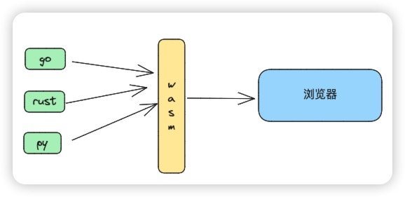
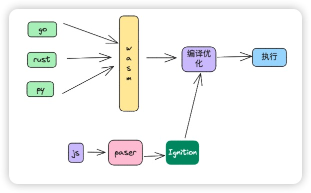
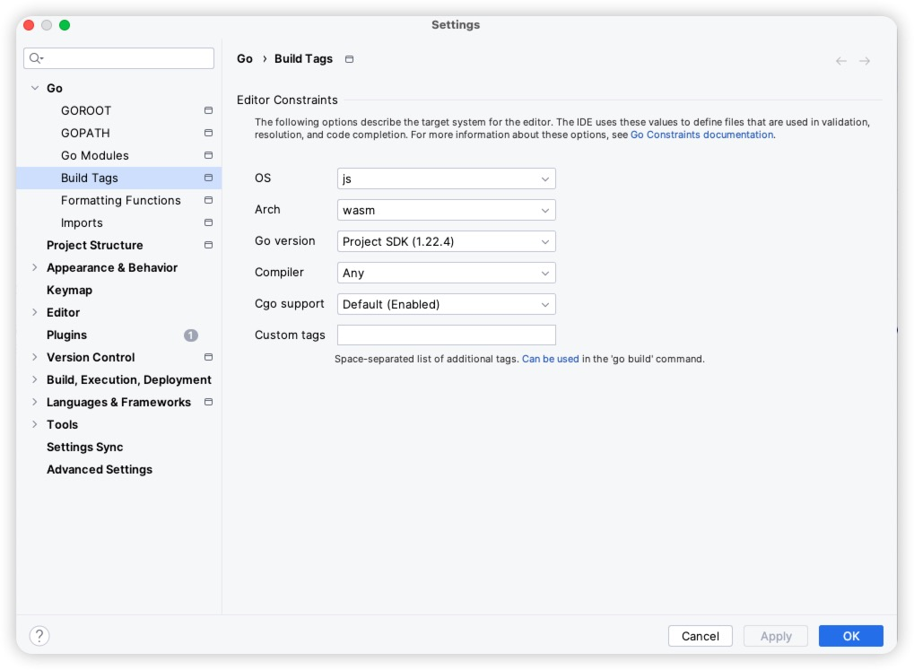

## 好话写在前面

好话写在前面， 也写在后面，大家好，我是韩数， 本来打算写一些 golang 其他的内容的， 在学习的过程中发现 (Wasm) WebAssembly 
这个东西，于是一阵好奇就好奇了一下，把玩了了一下就把玩了一下。 在了解 Wasm 的过程中翻阅了官网和很多资料， 为了避免之后的朋友们再学习 WebAssembly 的时候踩坑，于是才决定写下这篇博客。

##  Web Assembly 的定义

> Wasm (WebAssembly) 是一种运行在 Web 浏览器上的高效、安全的编程语言，旨在为 Web 应用提供一个更快、更安全、更灵活的运行环境。Wasm 通过提供二进制的格式和相关的 API，使得开发者能够在 Web 浏览器上运行 C/C++ 等语言编写的代码，从而实现更快、更高效的 Web 应用。

在这里我们现不扯什么 Web Assembly 的优缺点， 我们先看看 Wasm 这项技术具体解决了什么问题，在它的介绍里面指的是这行字: `从而实现更快、更高效的 Web 应用。`

为什么要实现 `从而实现更快、更高效的 Web 应用`呢，这是一个待解决的问题吗？  问这个问题，不如问： 你想在浏览器玩儿《黑神话悟空吗》？ 如果你是一家软件公司的老板，告诉我们的 Web 前端的同学说， 帮我写一个能在浏览器运行的黑神话悟空, 他当时脸上里一定是想要掐死你的表情。

虽然 js 目前已经成为世界上被使用最广泛的语言，但是需要大型 CPU 密集型项目这件事上仍然力不从心。 虽然 V8 引擎的出现犹如一道光芒照进了 js 的世界里，但是仍然加速比不上早已经装上曲率引擎的静态编译型语言上(C, C++)。 更何况 js 还是弱类型。 为什么 js 这么慢呢(相较于静态编译型语言)。 我们需要先看下 js 的执行流程， 如下图所示:


在我们的一段 js 代码真正的转换成二进制在硬件上执行时,  需要经过以下几个步骤:

1. 下载 js 代码文件， 这是一切的开始
2. 进入 Parser 步骤, Parser 主要负责将我们的 js 文件解析成抽象语法树(AST)。 在这个阶段可以通过语法分析发现一些编译时可以发现的问题。例如使用了未定义的变量， 函数少了个花括号等。
3. 第三步会经过 `Ignition`。 在这一步 js 的 AST 会被解释器转换成 Bytecode 字节码，解释并执行Bytecode, 这里的 Bytecode 是字节码，
4. TurboFan 编译器， 编译器会把字节码转换成汇编代码， 在这个过程中如何一个函数被多次执行，就会被认为是热点函数，会被 JIT 引擎编译成 机器码，这样下次再执行到这个函数的时候， 就会执行直接编译好的 机器码。 初看这个流程是很完美的， 代码跑的越久性能越高，隔壁的 java 就是靠着 虚拟机+JIT 技术性能上压 python 这些同样是解释型的语言一头的。 但是由于 Java 是静态类型的语言， 因此 JIT 编译之后的机器码几乎不会存在失效的情况。但 js 不一样了， 上一次执行可能入参是 Array 下次就可能会变成 int。 那么 JIT 辛辛苦苦做的优化就 前功尽弃了。

结合以上几点，我们发现，即使在最完美的情况下，使用 type js 在编写时提前约定好类型(编译成js仍然是动态弱类型的)， 减少 JIT 白忙活的概率，但是由于针对每行代码仍然需要经过 `Parser` 和 `Ignition` 这两个步骤，因此性能的优化也只能是 收效甚微 。

于是 `ams.js ` 诞生了。

## 插曲 ams.js 

2012年，Mozilla 的工程师 [Alon Zakai](https://github.com/kripken) 在研究 LLVM 编译器时突发奇想：许多 3D 游戏都是用 C / C++ 语言写的，如果能将 C / C++ 语言编译成 JavaScript 代码，它们不就能在浏览器里运行了吗？众所周知，JavaScript 的基本语法与 C 语言高度相似。于是，他开始研究怎么才能实现这个目标，为此专门做了一个编译器项目 [Emscripten](https://github.com/kripken/emscripten)。这个编译器可以将 C / C++ 代码编译成 JS 代码，但不是普通的 JS，而是一种叫做 [asm.js](http://asmjs.org/) 的 JavaScript 变体。

 ams.js 是 JavaScript 子集。 只能使用 JavaScript 一部分语法，既然因为动态类型，会在 Parser 这一步花费大量的时间在语法检查上，减少了 JavaScript 中动态类型检查的开销， 同样由于  ams.js 很多语法很接近汇编。 因此很多编译器也针对  ams.js 进行了优化。 但由于 ams.js  严格限定了类型， 可读性变得就很差， 对于我这种被高级语言惯坏了的人而言， 有点晦涩了，下面是一个 ams.js 写的 + 1 的例子。

```js
function add1(x) {
    x = x|0; // x 是一个整数
    return (x+1)|0; // 返回值转换为整数
}
```

至于性能的部分，关于 ams.js 网上的资料很少， 感兴趣的可以自行观看 [The JavaScript Compile Target Asm.js](https://johnresig.com/blog/asmjs-javascript-compile-target/) 这一篇文章，大概是在 2013 年发布的， 结论肯定是更快的， 这篇文章里面提大概是可以和 java 的性能相媲美， c++ 的二分之一。

好插曲讲完，接下来开始可以轮到我们的主角登场了，当当当当，当当当当（谨以此8个字悼念21世纪的福克斯）。 有请 `WebAssembly` 闪亮登场。

## WebAssembly 出场，我来拯救世界啦。

虽然 ams.js  强类型，很快，但是以巨大的可读性为代价仍然没有换来非常可观的性能提升。为什么，因为 ams.js 虽然是 JavaScript 的子集，但是执行的时候仍然需要 经过 `Parser` 和  `Ignition` 这两个耗时的步骤，于是天才就想，如果浏览器能够直接执行 `字节码` 那岂不是`性能起飞`？  

WebAssembly 不同于 ams.js。 WebAssembly `是一种字节码标准`。 这意味着任何语言都能实现它。 比如 golang  和 rust 就提供了把代码编译成 `WebAssembly` 字节码的实现。




这里需要值得注意是的， 不同语言编译生成的 WebAssembly 文件的运行性能并不一样 ！。WebAssembly 只是一种标准，具体的性能取决于实现它的方式，就像不同水平的程序员使用同一种语言写出来的代码性能也会有差异一样，各个语言编译成 WebAssembly 的时候也会把该语言的特性给编译进去，例如垃圾回收， 并发模型等等。 再叠加不同语言提供的 wasm 编译器有好有坏，因此性能上也会有差异， 这一点很多博客鲜有提及。

省去了  `Parser` 和  `Ignition`  这两个步骤，使得 WebAssembly 如静态语言一般在浏览器执行，性能带来了非常可观的提升， 



关于性能的部分，我更多的也是找的网上的相关资料, 大家感兴趣的话可以看一下

- [WASM isn't necessarily faster than JS](https://www.reddit.com/r/webdev/comments/uj8ivc/wasm_isnt_necessarily_faster_than_js/)
- [WebAssembly vs Javascript](https://ianjk.com/webassembly-vs-javascript/?ck_subscriber_id=1715213923)

注意： WebAssembly 不是万能解药， 并不一定能给你带来百分之百的性能提升， 使用 js -> webAssembly 时会额外多序列化和反序列化的开销， 因此比如你用 wasm 程序读取一个超大列表的长度， 可能花在序列化上的时间+运行的时间比你直接用 js 还慢很多。

## 现在终于可以开始说优缺点了

### 优点

1. 性能：Wasm 代码在 Web 浏览器上运行速度比 JavaScript 快得多，这使得开发者能够在 Web 浏览器上实现更复杂、更多功能的应用。
2. 安全：Wasm 代码运行在沙箱环境中，从而保证了应用的安全性。
3. 可移植性：Wasm 代码是二进制的，可以在任何支持 Wasm 的平台上运行，从而实现代码的可移植性。
4. 灵活性：Wasm 支持多种语言的编写，包括 C/C++、Rust、Go 等，这使得开发者能够使用自己熟悉的语言编写 Web 应用。

### 缺点:

1. 适用场景较少，适合 CPU 密集型的场景（比如 3D 渲染， 图像视频处理，在线游戏）, 目前 Photoshop， figma, AutoCAD 还有 谷歌地球 均使用了 WebAssembly 技术。
2. 和 JS 有通信的成本，通信频繁或数据量大会降低性能。js 于 wasm 通信会带来比较大的序列化和反序列化成本。
3. 对前端不友好，让前端学 rust 写 wasm . 前端为啥不用 rust 写更牛 x 的软件涨薪呢？
4. 调试起来比较麻烦，你的代码经过 wasm 编译之后几乎已经成了另外一副样子。

## 来一场酣畅淋漓的实战吧 ！

写了这么多，终于把背景知识写完了，接下来呢，我们将会使用 golang 编写一个可以动态给图片加水印的， 由于golang的那个库只提供了对 jpg 的支持， 因此只支持给 jpg 文件加水印。 预期实现的效果是这样的:


接下来的示例中， 为了保证阅读体验， 本文只会展示部分核心代码， 详细的示例代码已经开源到 github 代码该笔记对应的目录下，需要的同学可以自行获取。

## 设置 IDE

如果你是 golang 应用， 那么你需要 提前设置一下你的 Goland  IDE。



### 新建一个 main.go, 编写我们的代码

```go
package main

import (
	"bytes"
	_ "embed"
	"fmt"
	"golang.org/x/image/font"
	"golang.org/x/image/font/basicfont"
	"golang.org/x/image/math/fixed"
	"image"
	"image/color"
	"image/draw"
	"image/jpeg"
	"syscall/js"
)

// 省略一部分代码

func processImage(this js.Value, p []js.Value) interface{} {
	if len(p) < 2 {
		js.Global().Get("console").Call("log", "Error: Insufficient arguments")
		return nil
	}

	imgData := p[0] // 这里能读取 js 传过来的参数
	watermarkText := p[1].String() // 这里能读取 js 传过来的参数
	
	// 省略一部分代码
}

func main() {
	ch := make(chan struct{}, 0)
	// 输出将打印在 console log 中
	fmt.Println("Hello Web Assembly from Go!")
	var a []string
	a = append(a, "1")
	// 将函数导出到全局JavaScript环境，以便在JavaScript中调用
	js.Global().Set("processImage", js.FuncOf(processImage))
	// 从通道 ch 中接收数据。该操作会阻塞，防止主程序退出，直到从通道中接收到数据
	<-ch
}

```

### 编译我们的 main.go to wasm 

注意，当 golang 的代码被编译成 wasm 之后，跟 golang 就不存在运行时的关系了，也就是 main.wasm 和 golang 编译成的二进制一样，不需要 golang 提供的运行时了已经。


```bash
GOOS=js GOARCH=wasm go build -o main.wasm 
```

虽然 main.wasm 是个二进制，但是是可以被转换成 Wasm 的文本文件的，好处是，很好转，坏处是，几乎不可读。感兴趣的同学
可以把 main.wasm 文件拖拽到这个网站看看: [传送门](https://wasmdev.cn/wabt-online/wasm2wat/index.html)


### 编写我们的 index.html 

新建一个 assets 文件, 将上一步编译好的 `main.wasm` 放入 `assets` 下。执行以下命令
将 `wasm_exec.js` 文件拷贝至  assets.js 下。
```bash

cp "$(go env GOROOT)/misc/wasm/wasm_exec.js" ./assets
```

在 assets 新增 `index.html` 文件，碍于本文篇幅，省略了部分代码。
```html
<!DOCTYPE html>
<html>
<head>
    <meta http-equiv="Content-Type" content="text/html;charset=UTF-8"/>
    <title>Image Watermark with WASM</title>
    <style>
        // css 省略掉了
    </style>
    <script src="wasm_exec.js" type="text/javascript"></script>
</head>
<body>
<div class="container">
    <h1>Image Watermark with WASM</h1>
    <p class="instructions">请选择一张图片，然后输入水印文字，最后点击“添加水印”按钮。</p>
    <div class="input-group">
        <label for="imageInput">选择图片：</label>
        <input type="file" id="imageInput" accept="image/*">
    </div>
    <div class="input-group">
        <label for="watermarkText">水印文字：</label>
        <input type="text" id="watermarkText" placeholder="请输入水印文字">
    </div>
    <button onclick="addWatermark()">添加水印</button>
    <button onclick="reset()">重置</button>
</div>
<div class="result-container">
    
</div>
<script>
    const go = new Go();
    WebAssembly.instantiateStreaming(fetch("main.wasm"), go.importObject).then((result) => {
        go.run(result.instance);
    });

    function addWatermark() {
        const imgInput = document.getElementById('imageInput').files[0];
        const watermarkText = document.getElementById('watermarkText').value;

        if (!imgInput || !watermarkText) {
            alert("请选择图片并输入水印文字。");
            return;
        }

        const imgReader = new FileReader();

        imgReader.onload = function (e) {
            const imgArray = new Uint8Array(e.target.result);
            // 在这里我们把参数通过 js 传递给了 wasm，并获取到了 processImage 处理之后的结果
            const result = processImage(imgArray, watermarkText);
            if (result) {
                const blob = new Blob([result], { type: "image/jpeg" });
                document.getElementById('resultImg').src = URL.createObjectURL(blob);
            } else {
                alert("处理图片时出错");
            }
        };
        imgReader.readAsArrayBuffer(imgInput);
    }

    function reset() {
        document.getElementById('imageInput').value = "";
        document.getElementById('watermarkText').value = "";
        document.getElementById('resultImg').src = "";
    }
</script>
</body>
</html>

```

直接浏览器打开 index.html 即可, 不出意外的话应该可以看到最终的效果了。


## 总结

虽然 WebAssembly 看起来很好，但是适用的场景也是非常有限的, WebAssembly 并不是为了替代 js, 毕竟在 90% 的场景下，
js 的性能是完全够用的，大多数情况下遇到的性能问题往往是开发者使用了错误的方式导致的(写了大量的递归和低效率的代码)。WebAssembly 更适合
和 js 组合使用，作为 js 在性能这一块短板的补充，对于 js 而言，WebAssembly 更像是放在医院里面的那些高昂的进口药，虽然大多数时候都用不上，但是用到的时候往往能起到非常关键的作用。


