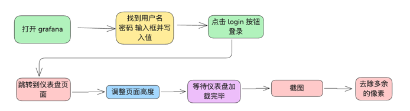
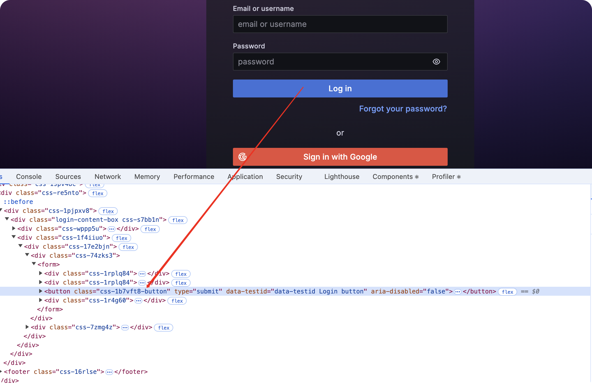
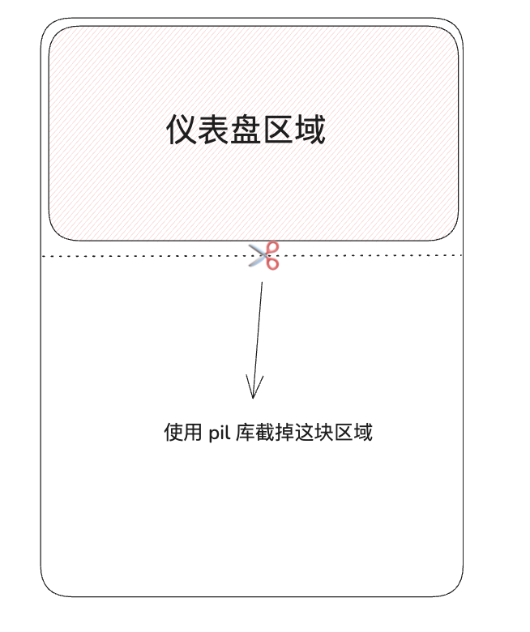
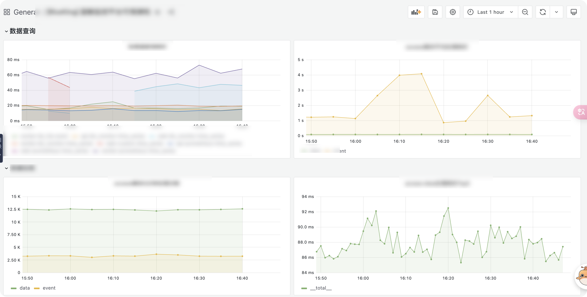

## 前言:

大家好，我是韩数，好久没有写技术博客了，最近在看告警引擎相关的实现，等到基本完善一些了到时候会写一篇博客分享出来，当然，除了搞告警引擎和 rust 之外我也有做一些其他的小玩意儿, 工作中有遇到需要导出 grafana 整个仪表盘作为运维周报的需求, 但是呢, 目前并没有什么开源的方案，官方的grafana render image 和 github 的一些方案都是基于导出单个 panel, 而无法导出整个仪表盘。考虑到整体实现方案应该差不多，所以我就先手搓了一个,  目前效果还不够完美，但是已经完全可用，后续完善之后会考虑作为一个单独的包开源出来。


## 原理

目前大多数的网页导出为图片基本上都是基于 无头浏览器实现的，我们也不例外，我们利用 selenium 起一个没有页面的 chrome 浏览器打开 grafana 的页面，模拟登录, 收起侧边栏等操作最后再进行页面截图。整体流程图如下:



## 开干

首先我们需要定义一个GrafanaImageExporter, 当然我只是习惯这么写，封装成了一个类，你可以歇写成别的:
``` python
class GrafanaImageExporter:  
  
    def __init__(self,  
                 grafana_host,  
                 username,  
                 password,  
                 dashboard_url=None,  
                 height=2300,  
                 output_file='dashboard.png',  
                 collapse_sidebar_button_id="dock-menu-button",  
                 login_button_css_name=".css-1b7vft8-button"):
        # grafana 的地址  
        self.grafana_host = grafana_host  
        # 用户名
        self.username = username  
        # 密码
        self.password = password  
        # 仪表盘
        self.dashboard_url = dashboard_url  
        # 输出的文件
        self.output_file = output_file  
        # 侧边栏按钮的id
        self.collapse_sidebar_button_id = collapse_sidebar_button_id  
        # 登录按钮的css name
        self.login_button_css_name = login_button_css_name  
        # 高度
        self.height = height  
  
        chrome_options = Options()  
        chrome_options.add_argument("--headless")  # 启用无头模式  
        chrome_options.add_argument("--no-sandbox")  # 解决一些权限问题  
        chrome_options.add_argument("--disable-dev-shm-usage")  # 解决共享内存问题  
  
        # Setup Chrome driver  
        driver = webdriver.Chrome(options=chrome_options)  
        self.driver = driver
```

### 紧张刺激的模拟登录环节

首先我们需要打开我们的 grafana 登录页面，不同版本的 grafana 可能 css 的 name 会有差别，因此我们需要获取自己版本的 grafana 登录按钮的 css name。

获取方式如下, 在我的这个版本中是 `.css-1b7vft8-butto`。



模拟登录的代码也很简单:
```python
def _do_login(self):  
    self.driver.get(f'{self.grafana_host}/login')  
    self.driver.maximize_window()  
    # 等待页面加载完毕  
    WebDriverWait(self.driver, 30).until(  
        EC.presence_of_element_located((By.NAME, "user"))  
    )  
    # 找到并输入用户名  
    username_input = self.driver.find_element(By.NAME, "user")  
    username_input.send_keys(self.username)  
  
    # 找到并输入密码  
    password_input = self.driver.find_element(By.NAME, "password")  
    password_input.send_keys(self.password)  
    # 点击登录按钮  
    login_button = self.driver.find_element(By.CSS_SELECTOR, self.login_button_css_name)  
    login_button.click()  
    # 等待三秒  
    time.sleep(3)  
    print("login success")

```

这里加入 sleep 的原因是, 可能因为网络问题按钮点击之后可能需要过一会儿才会完全登录完毕, 为了保证后面的跳转可以在登录成功之后，因此需要等待一段时间。


### 打开仪表盘并截图

这一步的操作会先将仪表盘设置一个很高的高度，因为在最新的 grafana 版本中，通过 `document.body.scrollHeight` 和 `document.documentElement.scrollHeight` 拿不到页面的总高度，因此我们简单粗暴，先设置一个比仪表盘总高度高得多的高度，然后我们再截图去掉底部因为超出高度多出来的像素，因为 grafana 的网页背景是纯色的，因此图形处理起来也很容易。



```python
def _export_dashboard_image(self):  
    print("now start export_dashboard_image....")  
    self.driver.set_window_size(1920, self.height)  
    self.driver.get(self.dashboard_url)  
    # 等待十秒等页面完全跳转到仪表盘界面  
    time.sleep(10)  
    # 收起侧滑栏  
    self._collapse_sidebar()  
    # 等待 30 秒等页面加载完成  
    self._wait_for_panel_render()  
    self.driver.save_screenshot(self.output_file)  
    self._remove_bottom_blank()  
    print("now start export_dashboard_image success...."
  
def _collapse_sidebar(self):  
    try:  
        # 等待页面加载完毕  
        print("now start collapse_sidebar....")  
        WebDriverWait(self.driver, 30).until(  
            EC.presence_of_element_located((By.ID, self.collapse_sidebar_button_id))  
        )  
        # 使用按钮的 ID 来找到并点击收起侧滑栏的按钮  
        toggle_button = self.driver.find_element(By.ID, self.collapse_sidebar_button_id)  
        toggle_button.click()  
        print("now start collapse_sidebar success....")  
    except Exception as e:  
        print("now start collapse_sidebar failed....")  
        raise e  
  
def _wait_for_panel_render(self):  
    print("now start wait_for_panel_render....")  
    # 找到所有具有 data-panel-id 的元素, 计算 panel 的数量  
    WebDriverWait(self.driver, 30).until(  
        EC.presence_of_element_located((By.CSS_SELECTOR, "[data-viz-panel-key]"))  
    )  
  
    elements = self.driver.find_elements(By.CSS_SELECTOR, '[data-viz-panel-key]')  
    panel_count = len(elements)  
  
    # # 等待所有的 panel 都加载完成  
    wait_panel_count = 0  
    while True:  
        wait_panel_count += 1  
        # 每个仪表盘等待三秒的时间加载  
        time.sleep(3)  
        print(f'Waiting for panel render {wait_panel_count}/{panel_count}')  
        if wait_panel_count > panel_count:  
            break  
  
```


### 处理底部多余的像素

我的这个版本的 grafana 的白色主题下，背景颜色 rgb 值为 `(244, 245, 245)` 我们只需要从图片底部向上扫描, 发现某一行出现其他颜色时, 将该图片从当前为止截断即可, 为了避免底部可能出现横向滚动条的影响，我们从倒数第 20 行开始扫描:

```python
def _remove_bottom_blank(self, blank_color=(244, 245, 245)):  
    # 打开图像  
    img = Image.open(self.output_file)  
    pixels = img.load()  
  
    # 找到最后一行非空白的像素  
    bottom = img.height  
    start_scan_line = max(0, img.height - 20)  
    for y in range(start_scan_line - 1, -1, -1):  
        for x in range(img.width):  
            if pixels[x, y] != blank_color:  
                bottom = y + 1  
                break  
        if bottom != img.height:  
            break  
  
    # 裁剪图像  
    cropped_img = img.crop((0, 0, img.width, bottom))  
    cropped_img.save(self.output_file)
```


### 在 linux 服务器上运行要麻烦一些

在 linux 服务器上运行要麻烦一些，我们需要在 linux 中安装一个 chrome 浏览器，并下载好相关的驱动，驱动的话我们可以用 `webdriver_manager` 包来自动安装合适的驱动。中文仪表盘可能需要安装对应的中文字体才行。

脚本如下:

```bash
#!/bin/bash

wget -q -O - https://dl.google.com/linux/linux_signing_key.pub | apt-key add -

echo "deb [arch=amd64] http://dl.google.com/linux/chrome/deb/ stable main" | tee /etc/apt/sources.list.d/google-chrome.list


apt update
apt install -y google-chrome-stable


pip install pillow==11.0.0
pip install selenium==4.26.1
pip install webdriver-manager==4.0.2

```

然后把 driver 初始化的那一行改成如下即可:
```
driver = webdriver.Chrome(service=Service(ChromeDriverManager().install()), options=chrome_options)
```


### 完结撒花, 最后看效果



整体而言效果还行，我这个方案只处理了白色主题的 grafana，需要黑色主题的请自己做修改，目前还有几个关键的小点没有解决掉，比如说如何获取页面准确的高度？或者是不是可以监控某个标签的变化判断所有仪表盘已经加载完毕了？ 我前端比较菜，如果有人知道的话欢迎留言到本文下方。

