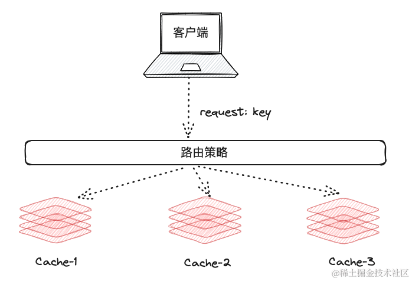
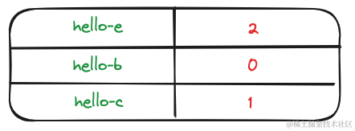
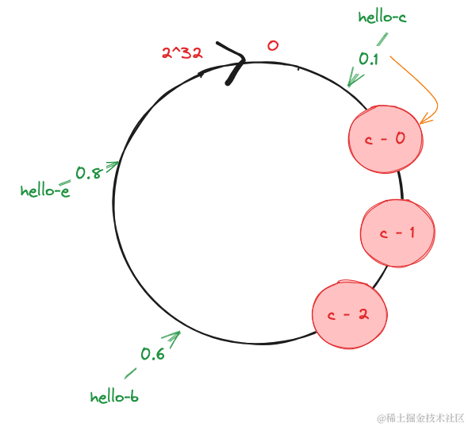

本文使用的绘图工具为: https://excalidraw.com/


# 前言

在系统地学习一个知识点之前，我们首先需要做的就是了解该知识点具体解决了一个什么样的问题，比如雪花算法解决了一个分布式唯一ID生成器这样一个业务场景, 毕竟在生成例如电商系统的工单号的时候，是不能容忍出现相同的订单号这样的错误的。但是唯一ID生成的时候，并不意味着雪花算法就是唯一的方案，毕竟使用Mysql的自增主键和UUID也可以解决唯一ID这个问题。这个时候具体选用哪种实现，就需要根据具体的业务场景去选择了。

那么一致性Hash 具体解决了一个什么样的问题呢？作为图解系列的第一篇文章，我们首先去看一下，当一个分布式的缓存系统，没有实现一致性 hash 算法的时候，将会面临哪些问题。

## 先从负载均衡说起

当我们在一个缓存系统中引入多台主机实例的时候,  这个时候我们的路由策略实际上就是解决的负载均衡的问题。


说到负载均衡，第一个想到的自然是Nginx 了，一般常用的Nginx 的负载均衡策略有这几个
- 轮询
- 随机
- hash
- 权重

由于我们需要解决的是分布式缓存的问题，而不是像 web 领域哪种只是单纯的针对请求做负载均衡，那么轮询和随机和权重就不是我们能考虑的范围了。假设我们的分布式缓存使用随机作为负载均衡的策略，那么会出现下图这种情况。


在上图中缓存服务器有两种策略:
- **获取不到缓存，则返回空**，由于是随机调度，假设 key: hello 的 value 缓存在 cache-1 的服务器上，那么我们只有1/3 的概率可以命中 cache-1获取到缓存中的 value。而另外2/3的概率是查不到缓存的，假设客户端查不到缓存就去 db 去查询的话，带来的问题就是仍然有大量的流量请求到了 db。分布式缓存并没有起到它应有的作用。
- **缓存服务器没有命中, 返回空，之后去 db 将缓存更新到该服务器**，这样造成的后果就是 cache-1, cache-2,cache-3 一定时间后都会存在 hello: world 的缓存数据，数据被重复存储了，分布式缓存同样也没有起到它应有的作用。

所以在`分布式缓存/有状态的负载均衡` 这一前提下，符合我们条件的负载均衡算法能满足如下条件:

**相同请求的内容应当固定负载到某台服务器上**

这个时候有人要跳出来问了，为什么一定要 hash 取模 这种方式，我难道不能用 mysql 去记录下这些 key 到 缓存服务器的 规则吗？ 是可以的，确实我也见有人这么干过，但是比起 hash 的成本而言，hash 取模往往是比较划算的实现方式。

## 并不一致的 hash 算法

hash 算法有一个最核心的特点:  `对同一个关键字进行哈希计算，每次计算都是相同的值`
```python
hash(key) % 3
```
这样我们就保证了 `一个 key 经过同样的计算逻辑之后得到的是一个固定的值`，也就是这个 key 始终会被路由到一台固定的缓存服务器上。

首先我们先用 python 实现一个 hash 取模的函数:
```python
import hashlib  
  
key1 = "hello-e"  # 2  
key2 = "hello-b"  # 0  
key3 = "hello-c"  # 1  
  
  
def get_index(key, replicas):  
    hash_object = hashlib.md5(key.encode())  # 使用 md5 哈希函数  
    hash_value = hash_object.hexdigest()  
    return int(hash_value, 16) % replicas
```

经过该函数的计算之后，我们会得到这样一个映射关系:




代入到我们上面的负载均衡图，大概是下面这样:


这样当我们请求 `hello-b` 的时候，我们每次都会路由到 `cache-0` 这台机器上，现在这张图看起来有那么点分布式缓存的意思了。

但是请不要忘记，我们做的是分布式缓存，在分布式系统中，机器加一台少一台都是很常见的事情，当我们 cache-2 挂了的时候，我们上面这套思路会发生什么奇怪的变化？

当取模从 3 变成 2 时, 会发现缓存的映射完全对不上了，之前的 key 将不能再次路由到之前的那台服务器上，如果我们要保证缓存系统的正常运行，那我们在最糟糕的情况下，我们需要对所有的缓存进行数据迁移。


而新增一个节点，同样也会带来相同的问题，因为需要根据新的机器数量进行取模(因为如果不更新取模的基数的话，那么新机器永远不会被路由到)，在极端情况下仍然需要迁移所有的数据，这个迁移成本太高了。

看到这里，想必你已经发现了导致负载均衡结果不一致的罪魁祸首！那就是 机器的数量，也就是:


既然 取模运算中 基数的变化， 会导致数据的映射也发生变化，那如果我想要数据映射尽可能的不发生变化，是不是只要基数不变就可以了？

你就是天才，出院！

这就是 一致性 hash 解决这个问题的核心方式，`固定基数`。

## 一致性 Hash 算法

一致哈希算法也用了取模运算，但与哈希算法不同的是，哈希算法是对节点的数量进行取模运算，而**一致哈希算法是对 2^32 进行取模运算，是一个固定的值**。（这里的2^32是个约定，你也可以选择其他的数，固定就行）

因为 hash 取模本身就已经限定了一个范围，例如在上述基数为 3 的例子中，我们最终得到的结果就是 0,1,2 这三种可能性，如果我们把 2 和 0 收尾相连，就可以得到一个 hash 环。而一致性 hash 的基数是
**2^32**， 所以最终会形成一个 **0** - **2^32** 的 hash 环。


这个时候如果我们把基数固定成**2^32** 再执行我们的 hash 取模，我们会得到如下这样一张映射表，其中小数部分表示映射的值在 hash 环上的大概位置。


假设(当然不是一定的)，我们的三个节点在 hash 环上的分布是如下的(相对比较均匀)的。我们先看看一致性 hash 是如何选择节点的:

在下图中 hello-c 这个 key 命中了 hash 环上 1/10 的位置，这个时候这个位置是没有任何节点的，于是我们沿着 hash 环顺时针向下寻找，最终命中到了 c-0 这个节点。


看不出来一致性hash 相较于固定基数的 hash 带来了哪些改进？那我们试着把`c-0`节点干掉试试！


这个时候我们会发现，只有 `hello-c` 这个 key 受到了影响，命中了 `c-1`服务器，而 `hello-b` 和 `hello-e` 都没有受到影响，仍然命中 `c-2` 服务器，这就在一定程度上`避免了因为频繁增删节点造成的数据迁移的问题。`

这样看，一致性 hash 还是比较完美的，似乎没什么缺陷？ 你现在会觉得没什么缺陷是因为我画图画的太好了，简直是天生画图圣体，假设我的三个节点如此分布，阁下又当如何应对？



由于我们的三个节点非常团结，导致节点在 hash 环上的分布已经到了非常之不均匀的地步，这样造成的后果就是我们 `80%` 的 key 都被路由到了 `c-0` 这个节点上，节点` c-0`表示:  `我吃柠檬`。

这个时候如果 `c-0`没有扛住了，c-1 表示：`我？ 我也挂`，`c-1 挂了，c-2 挂`，最后缓存雪崩了。最核心的原因其实就是：

**一致性 hash 虽然解决了增删节点之后数据迁移的问题，但是还是存在节点分布不均导致流量没有被均匀负载的问题。**

在上面的案例中，`c-0`,`c-1`,`c-2`  是三台不同的主机，可能是使用主机名，或者 ip 地址去做取模，不管怎么取三个节点在 hash 环上分配的比较均匀的概率还是很低的。想要提高概率，那应该怎么做？ 梭哈！只要我的节点足够多，那是不是就能大概率保证节点足够均匀了？ 比如每个节点搞100个虚拟节点放hash 环上， 那三台机器映射到 hash 环上300 个虚拟节点肯定要比 3 个节点分布的均匀些。


> 
> 读者需要注意的是，很多博客的图和上面的图一样：
> 
> `c-0`, `c-1`, `c-2`是顺时针按顺序排列的，这不是规定！实际上由于 hash 运算，在 hash 环上什么样的顺序和位置都是有可能的。没有必然的约定一定要按顺序排列。


## 带虚拟节点的一致性hash

终极解决方案出来了，使用虚拟节点.

画成图就是下图，真让我画 300 个节点我手画断了，键盘都要画出来火星子，所以我们每个节点我只画三个虚拟节点，意思意思就行。

三种颜色分别代表`c-0`,`c-1`, `c-2` 三台机器，注意`虚拟节点在环上的位置完全是随机的，没有顺序关系`。


通过虚拟节点的方式，在很大程度上就解决了节点分布不均匀的问题。注意，**由于虚拟节点在环上的位置随机，所以某台机器挂了之后，那么原先在这台机器上的 key 会被随机分配到不同的节点上**，也避免了某个节点挂掉之后，全部路由下个节点的问题。同时我们也可以**给机器加权重了，例如机器配置好的节点我多加点虚拟节点把更多的流量路由到这台机器上。**

注意:  删除某个节点时，需要把所有虚拟节点都删除。

那我们如何衡量一致性 hash 算法的好坏，而引入节点究竟做了哪方面的改进？主要有以下两点:

- 平衡性：指哈希的结果能够尽可能分布到所有的节点的值域中，这样所有节点的值域都能得到利用，一致性 hash 标准版无法满足这一点，我们通过增加虚拟节点的方式解决了这一点。
- 单调性: 新加入的节点可以顺其自然的接入流量提供服务，删除某个节点也不会把改节点的流量全部转移到另外一个节点上。通过固定基数和 hash 环的方式我们实现了一定的单调性，即新加入的节点是 可以马上提供服务的，通过增加虚拟节点的方式我们满足了某个节点退出之后该节点的流量均匀调度到其他节点上的问题。

> 扩展思考：
>  redis 集群使用到了 哈希槽， 和我们今天讲的一致性 hash 有什么区别呢？

附: python 代码实现

```python
# -*- coding: utf-8 -*-  
  
"""  
一致性 hash 代码基础实现  
"""  
  
import hashlib  
from typing import List  
  
  
class YHash:  
  
    def __init__(self, nodes: List[str], virtual_node_num: int = 3) -> None:  
        self.virtual_node_num = virtual_node_num  
        # 虚拟节点:实际节点的映射  
        self.virtual_node_dict = {}  
        # 虚拟节点在 hash 环上由大到小排序的列表  
        self.virtual_node_sort_list = []  
        if nodes:  
            for node in nodes:  
                self._add_node(node)  
  
    def _add_node(self, node: str) -> None:  
        for i in range(self.virtual_node_num):  
            virtual_node_key = "{}_{}".format(node, i)  
            hash_value = self._generate_hash_value(virtual_node_key)  
            # 建立虚拟节点 - 真实节点的映射  
            self.virtual_node_dict[hash_value] = node  
            self.virtual_node_sort_list.append(hash_value)  
  
        # 保证列表有序，因为我们需要获取到某个 key 命中的区域的下一个虚拟节点  
        self.virtual_node_sort_list.sort()  
  
    def get_node(self, key: str) -> any:  
        if not self.virtual_node_sort_list:  
            return None  
        hash_value = self._generate_hash_value(key)  
        for i in self.virtual_node_sort_list:  
            if hash_value <= i:  
                return self.virtual_node_dict[i]  
        return self.virtual_node_dict[self.virtual_node_sort_list[0]]  
  
    def remove_node(self, node: str) -> None:  
        for i in range(self.virtual_node_num):  
            # 基数固定，这里的hash_value是固定的  
            virtual_node_key = "{}_{}".format(node, i)  
            hash_value = self._generate_hash_value(virtual_node_key)  
            # 删除映射  
            if hash_value in self.virtual_node_dict:  
                del self.virtual_node_dict[hash_value]  
            if hash_value in self.virtual_node_sort_list:  
                self.virtual_node_sort_list.remove(hash_value)  
  
    def _generate_hash_value(self, key):  
        hash_object = hashlib.md5(key.encode())  # 使用 md5 哈希函数  
        hash_value = hash_object.hexdigest()  
        # 这里选择 2 ** 32 作为固定基数  
        return int(hash_value, 16) % 2 ** 32  
  
  
if __name__ == '__main__':  
    nodes = [  
        "cache-0",  
        "cache-1",  
        "cache-2"  
    ]  
  
    h = YHash(nodes)  
    print(h.virtual_node_dict)  
    key = "hello_world"  
    print(h.get_node(key)) # cache - 0  
    h.remove_node("cache-0")  
    print(h.get_node(key)) # cache - 1
```