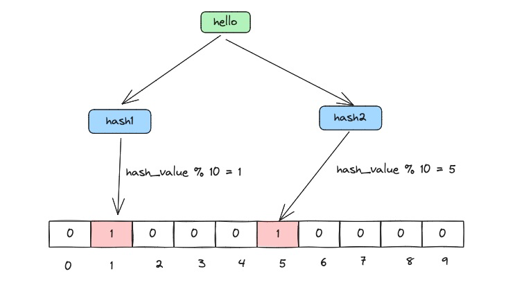
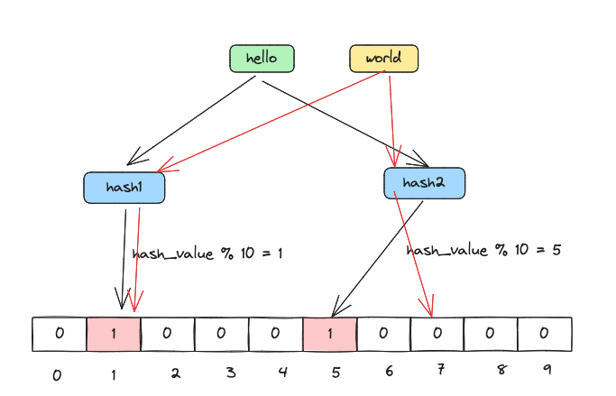
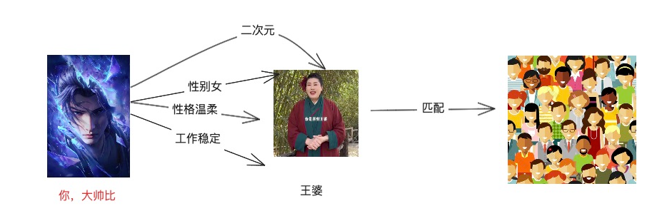
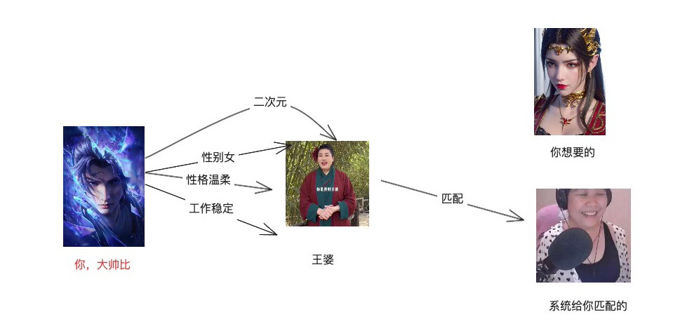
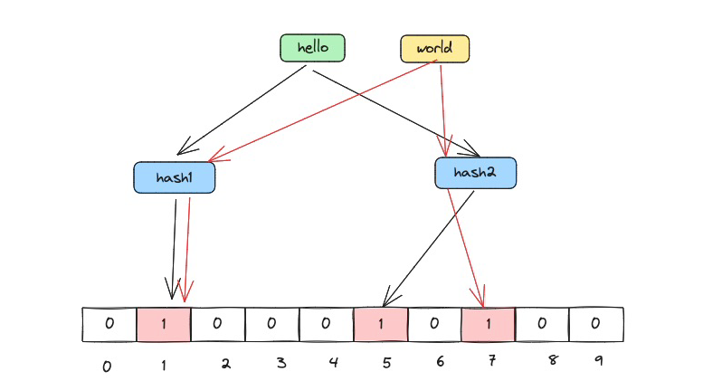

## 前言

大家好，我是韩数，前两天刷到一篇布隆过滤器的文章，看完发现觉得总少了些什么， 虽然布隆过滤器这个东西名字听起来很高大上， 实现起来很简单，但是要讲清楚其实也是一件不容易的事情，之所以写这篇文章， 还是想着能够全面系统的讲清楚布隆过滤器这个东西，毕竟这个在 redis 和 分布式系统中使用的还是比较广泛的。文末会附带 golang 的实现。不废话，直接开始吧

## 布隆过滤器基本概念
布隆过滤器有两部分组成， k 个 hash 函数，和长度为 x 的数组(只存储 0 和 1),  当我们要存入一个数据时， 经过 k 个 hash 函数运算的结果分别与数组的长度 x 取模，并将取模得到的数组的位置的值设置为 1。 概念不容易说明白，直接上图吧。

假设我们需要向 布隆过滤器中 添加一个元素 `hello`， 现在我们的布隆过滤器设置数组长度为 `10`,  hash 函数的个数为 `2`， 那么当我们添加元素 `hello` 的时候，会经过 hash 运算之后得到一个整数， 用该整数和数组的长度进行取模， 假设我们计算出来的 hash_value 是 `11`, 那么 取模运算就是:

`11 % 10 = 1` 

从而我们就可以得到数组中的下标为 1， 我们把下标为 1 的位置标记为 1。 其他的 hash 函数依次如此操作， 具体为什么需要 多个 hash，接下来会讲。 为什么要和数组的长度 x 取模呢？ 主要是为了得到数组长度范围内的下标。 确保 hash 的值可以准确地落在数组里面。

### 布隆过滤器的判定

布隆过滤器的判定很简单， 输入 `hello` 进行计算

**如果对应数组中的下标都为 `1`, 说明该值有可能存在。 如果有 `0`, 说明该元素一定不存在。**  记住这句加粗的，重点要考的。

例如在下图中， `world` 经过 hash 计算之后 得出 0 和 1 两个结果，说明 world 在布隆过滤器中一定不存在。

，

## 忘掉布隆过滤器
枯燥的概念讲完了，但是按照我们所有文章的传统， 文章可能才刚刚开始，好了现在让我们忘记布隆过滤器， 想象你是一个渴望爱情的年轻人，来到了王婆说媒的现场，此刻你要寻找你的真命天女。 当然，既然你单身，说明你还是有一些条件在的， 安全声明： 男女平等， 本例子没有歧视任何人的意思，你的条件如下:

- 性别： 女生
- 工作： 稳定
- 爱好:  二次元
- 性格：善解人意

于是你把要求给了王婆，王婆还真匹配到一个， 请问这个匹配到的就一定是你的真命天女吗？

你会说，那不一定， **满足这些条件的女生很多，但不一定就是我想要的那个一生所爱** 。 因为大多数情况下你得到的结果往往是下图这样。

，

但是反过来，如果王婆跟你说， **很遗憾，下面没有符合你要求的**, 这可以得到一个结论， 你想要的真命天女 百分百不在 今天的观众里面。

所以， 家人们啊，王婆是什么？ 大声告诉我， 王婆就是个现实世界的 **布隆过滤器**啊。 而你提的那些条件就是一个个 hash 函数啊。 朋友们，顿开了没有茅塞。

hash 函数虽然重复的概率很小，但是架不住样本大的时候仍然会重复啊， 所以再回到上面加粗的那句话： 

**如果对应数组中的下标都为 `1`, 说明该值有可能存在。 如果有 `0`, 说明该元素一定不存在。** 

同样的，这个例子也告诉我们一个道理，**如果你的条件足够多(hash 函数的个数)， 那么系统误判的可能性就越小**。但是相应的，匹配起来速度也会慢很多。 所以相亲匹配是一门条件和匹配速度均衡的艺术。

## 布隆过滤器的第二个特点:

布隆过滤器的第二个特点是： 数据一旦被加入到**布隆过滤器中，那就不允许再删除了**， 为什么？ 因为布隆过滤器某个位置可能是多个 元素的计算结果。 不明白是吧，家人们， 看下图，图解图解，要的就是一个图多量大。

，

假设我们要在布隆过滤器删除 hello 这个元素， 怎么删， 因为我们没法 把 数组 为 `1` 的位置重置为 0 ， 重置为 0 下次判断 world 是不是存在的时候就受影响了。 其他本来存在的元素会被判断为不存在。布隆过滤器的第一个前提也就不成立了。 **如果对应数组中的下标都为 `1`, 说明该值有可能存在。 如果有 `0`, 说明该元素一定不存在。**

## 布隆过滤器的优缺点和应用场景

想不到的话，别想布隆过滤器了，想想王婆。 算了，还是想布隆过滤器吧。

### 优点

- 相比于其它的数据结构，布隆过滤器在空间和时间方面都有巨大的优势。布隆过滤器存储空间和插入/查询时间都是常数（即hash函数的个数, 想想我们之前的go map 原理， 一致性 hash 那两篇文章， hash 有什么特点？ 就是快）。为什么省空间，布隆过滤器本身是一个 位数组，只包含 0 和 1。 一亿个位数组可能就只占几 m 内存。一亿条数据在 mysql 最少也要上 G 了。两者判断元素是否存在需要花费的代价，不在一个量级。更何况数组再大经过 hash 运算之后得到的也是具体的下标。 取值的时间复杂度为 0（1）. 怎么看都是一笔划算的买卖。

- Hash 函数相互之间没有关系，方便由硬件并行实现。
- 布隆过滤器不需要存储元素本身，在某些对保密要求非常严格的场合有优势。(场外解说: 因为布隆过滤器只保留了数据不同hash函数的运算的结果在数组中位置的映射, 和 mysql 去查询数据是不是存在不一样的， mysql 是基于元素本身的值匹配来实现的)

### 缺点
- 可能会存在误判的情况， hash 虽然重复的概率很小，但是架不住样本大啊。
- 不支持删除。

### 使用场景

在样本数量比较大的情况时， 判断该元素是否存在。 注意是样本数量比较大， 如果 mysql 表只有几百条数据， 不是，哥们儿， 咱就别折腾了，老老实实直接连 DB 判断就行。
- 原本有10亿个号码，现在又来了10万个号码，要快速准确判断这10万个号码是否在10亿个号码库中？
- 垃圾邮箱的过滤， 如何判断某个邮箱是否是垃圾邮箱，垃圾邮箱库可能记录了数百万的垃圾邮箱。
说来说去，只有一种场景，  **快速判断一个元素是否存在大样本集合中， 都可以用布隆过滤器**。 假设有一个蔡徐坤黑粉名单，如何快速判断一个人是不是蔡徐坤黑粉，就可以使用布隆过滤器，或者来一段哥哥的舞蹈试图看看他的DNA 会不会有反应。 

## 概念整完了，该整代码实现了

本文附带的代码实现是非常非常基础的思路实现， 真上生产的话， 有很多优秀的高性能的布隆过滤器实现的。

家人们，我干了，都在注释里。代码请移步本目录 `code` 文件夹中。

