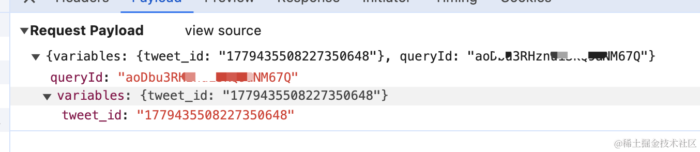
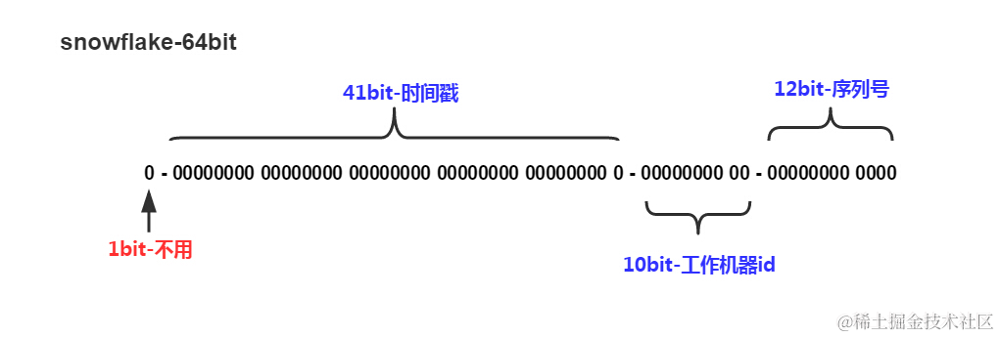
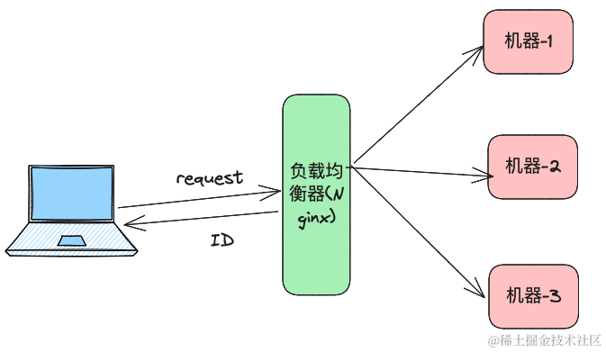

文章的开头，`求赞，求收藏, 求关注`，图解系列专栏所有文章不会有任何第三方平台的引流&广告，纯粹的技术分享为主，感兴趣的话可以关注下专栏，我会尽量保持每周一篇的更新速度。掘金专栏地址: [图解系列](https://juejin.cn/column/7356240651041030159)

在上一篇文章[图解一致性Hash](https://juejin.cn/post/7356240651041046543)文章，我们非常详细的讲解了一致性 hash，本篇文章作为图解算法的第二篇，我们将用同样的思路来拆解雪花算法。本篇文章我们主要带着以下几个问题？

1. 雪花算法或者相近的算法具体解决了什么问题？
2. 除了雪花算法之外还有其他的方式可以实现类似的效果么？
3. 雪花算法是什么？

## 雪花算法或者相近的算法具体解决了什么问题？

根据维基百科的定义: **雪花算法**（Snowflake）是一种生成分布式全局唯一ID的算法。 有句老话说得好，这个世界上不存在两片完全相同的雪花。雪花算法主要的作用就是`生成分布式全局唯一ID`。 比如推特把雪花算法使用在`推特的推文ID`。



这个时候有人问了，假设我有一个电商系统，每天都有`好几十个人`下单，电商系统的单号明显是需要唯一的，这种场景下我需要用雪花算法吗？

还记得我们上篇文章针对一致性 hash 时候说的话吗，`不同的实现思路没有绝对的优劣之分，我们在实际的开发过程中，更多的是 实现成本+复杂度+业务场景 之间的权衡`。杀鸡焉用牛刀，如果我们的业务规模很小, 这种情况下我们使用 UUID 和 数据库自增ID来生成对应的唯一ID就可以满足需求了。

## 如果没有雪花算法的话？

如果没有雪花算法的话，程序员的世界会变成什么样子？ 一片荒芜？ 还是一切如故。对不起文艺病犯了。要知道，根据可靠的情报(wikipedia)，雪花算法是 2010 年Twitter发布的，这并不意味着 2010 年前大家不需要分布式唯一ID了，这就和野生大熊猫在外面有野人喂是一个道理，实际上还是有很多的方案的，最常见的方案主要是这两种:

- MySQL 自增ID
- UUID 

### MySQL 自增ID

当我们需要唯一ID的时候，我们大多数人的第一反应可能就是MySQL的自增ID, 主要的优缺点如下:
#### 优点
- 使用成本较低，如果项目本身使用了 `MySQL`，基本上不需要引入额外的组件依赖，其中 int 类型最大的范围是: `2^32-1(4294967295)`, 也就是大概 `4.2 亿`条数据。bigint 类型最大可以到 `2^64(18446744073709551616)`，int 类型基本上足够大多数业务场景的使用了。当然单表如果 4.2 亿条数据，mysql 会有严重的性能问题(挖个坑，以后写到 mysql 索引的时候再补上)。这个时候我们可以十张表，从不同的数字开始，比如表 1 生成，`1-2000w`，表 2 的 id 从 `2000w+1`开始。
- 磁盘占用小: 相较于UUID,  自增主键本身是有序的，在磁盘上顺序存储, 据不可靠情报，所占的空间要比UUID小大概50%。
- 查询快，写入效率高。查询快指的是自增主键使用聚簇索引并且有序,插入新数据可以直接根据索引中的最大值+1 确定新插入的位置。 
#### 缺点
- `防不住老六`，假设订单号是 1,2,3,4,5,6,7 这样的顺序递增，很容易就猜到下一个订单对应的是什么，对爬虫极度友好，如果在凌晨00:00发起一个订单，等到晚上24:00的时候发起一个订单，两个订单号相减很容易被人猜到订单量这种核心业务数据。
- 不够分布式:  如果只有一台 MySQL 实例，那么ID是可以保证不会重复的，但是有多台MySQL 实例的话，由于自增ID都是从 1 开始的，就会导致ID重复，在这种情况下如果要保证ID不重复，需要提前为各个MySQL 实例分配好号段，比如Mysql-1 对应 1-1000w，Mysql-2  对应 1000w +1 - 2000w 的区间，指定每个MysSQL实例从不同的位置开始自增，但是这样做的话额外增加了系统的复杂度，涉及到数据迁移的时候也不友好。
- 由于Mysql 执行插入是会有加锁的开销，因为在并发大量插入时，可能会有一定的性能问题
- 强依赖DB系统，如果MySQL服务挂了，会导致整个系统不可用。

### UUID
相信对于后端开发的同学来说对UUID并不陌生，这里援引 wiki 百科的介绍:

> **通用唯一识别码**（英语：**U**niversally **U**nique **Id**entifier，缩写：**UUID**）是用于[计算机](https://zh.wikipedia.org/wiki/%E7%94%B5%E5%AD%90%E8%AE%A1%E7%AE%97%E6%9C%BA "电子计算机")体系中以识别信息的一个128位标识符。UUID按照标准方法生成时，在实际应用中具有唯一性，且不依赖中央机构的注册和分配。`UUID重复的概率接近零，可以忽略不计`

由于UUID的重复概率非常之低，v4版本的大概 `2 的 122 次方分之一`，这在`99.9%` 的场景下几乎等同于不会重复了。关于UUID的计算方法网络上有很多文章，这里就不再赘述了。

使用 python 可以很方便的生成一个 uuid:
```python
import uuid
print(uuid.uuid4()) #7330e875-b2e9-4ac9-89b8-b03bd4a7f73a
```

UUID 的优缺点也很明显。

#### 优点
- 能够有效的防老六，由于UUID是无序且无规律的，用户拿到UUID之外并不能得到其他有效的信息。
- 生成速度飞快，由于是本地计算生成，UUID的生成速度很快，也无需担心并发量高的时候锁竞争的问题。
#### 缺点
- 内存占用高: 由于UUID去掉`-`字符后仍然还有 32 位字符串的长度，比起数据库自增主键ID，天然的需要更大的磁盘空间来存储，第二点由于MySQL innodb 引擎维护的是 `b+树`索引，UUID本身是无序的字符串，大量的插入的情况下b+树索引需要频繁调整节点顺序, 这会带来大量的页分裂，会有一定的查询和插入性能损耗。
- 可读性比较差，这也不能完全算缺点。

### 雪花算法

终于步入正题了，尽管我们上诉两种方案都有明显的缺点，但是在业务量没那么大的情况下，这些缺点是完全可以接受的，所以在业务规模并不是十分巨大(十亿，百亿，千亿...)级的时候，使用 UUID 和 MySQL 时更加合适的选择。但是业务规模特别大的时候，MySQL 和 UUID 的缺点就比较致命了，这个时候就需要使用分布式的ID生成算法了，最经典的就是`雪花算法`。

#### 雪花算法的定义

这里引用 wiki 百科的定义:

> **雪花算法**（Snowflake）是一种生成分布式全局唯一ID的算法，生成的ID称为**Snowflake ID**s或**snowflake**s。这种算法由[Twitter](https://zh.wikipedia.org/wiki/Twitter "Twitter")创建，并用于推文的ID。[Discord](https://zh.wikipedia.org/wiki/Discord "Discord")和[Instagram](https://zh.wikipedia.org/wiki/Instagram "Instagram")等其他公司采用了修改后的版本。
> 
> 一个Snowflake ID有64[比特](https://zh.wikipedia.org/wiki/%E4%BD%8D%E5%85%83 "比特")。前41位是[时间戳](https://zh.wikipedia.org/wiki/%E6%99%82%E9%96%93%E6%88%B3 "时间戳")，表示了自选定的[时期](https://zh.wikipedia.org/w/index.php?title=%E6%97%B6%E6%9C%9F_(%E9%9B%BB%E8%85%A6)&action=edit&redlink=1)以来的毫秒数。 接下来的10位代表计算机ID，防止冲突。 其余12位代表每台机器上生成ID的序列号，这允许在同一毫秒内创建多个Snowflake ID。最后以十进制将数字序列化。
> 
> SnowflakeID基于时间生成，故可以按时间排序。[1](https://zh.wikipedia.org/wiki/%E9%9B%AA%E8%8A%B1%E7%AE%97%E6%B3%95#cite_note-1) 此外，一个ID的生成时间可以由其自身推断出来。该特性可以用于按时间筛选ID，以及与之联系的[对象](https://zh.wikipedia.org/wiki/%E7%89%A9%E4%BB%B6_(%E9%9B%BB%E8%85%A6%E7%A7%91%E5%AD%B8) "对象 (计算机科学)")。[2](https://zh.wikipedia.org/wiki/%E9%9B%AA%E8%8A%B1%E7%AE%97%E6%B3%95#cite_note-2)

结合经典的雪花ID图和定义，我们来简单概要的总结一波雪花算法的特征。



1. 雪花算法生成的是一个 `64` 位的数字，主要由以下四部分组成。
   - `第1位`占用1bit，其值始终是`0`，可看做是符号位不使用。
   - `第2位`开始的41位是时间戳，41-bit位可表示`2^41`个数，每个数代表毫秒，那么雪花算法可用的时间年限是`(1L<<41)/(1000L360024*365)`=69 年的时间。
   - `中间的10-bit位`可表示机器数，即`2^10 = 1024`台机器，一般不需要这么多机器，可以按需分出来一些字段加一些业务相关的信息。
   - `最后12-bit位`是自增序列，可表示`2^12 = 4096`个数。
	经过我们的一通计算，在毫秒内单台机器理论上可以生成 `4096` 个ID，如果我们把机器ID用满的话，每毫秒，注意是每毫秒大概可以生成 `1024*4096 ≈ 429w` 个ID。 一秒就是 `4200w` 个ID，对于100%的场景来说也足够使用了。
1. 生成的数据是有意义的，只需要把得到的ID分解一下就可以知道时间，机器，序号等信息。
2. 数据可以根据`时间排序`，由于时间戳放在前面，意味着我们可以根据简单的整数比较就可以过滤出来某个时间段内的数据，或者将数据根据时间升序或者降序排序。
3. 性能非常之高，由于我们的每台机器只负责生成该机器所对应的雪花ID，由于机器ID不同，`不同机器生成的ID不可能相同`，所以每台机器只需要关注自身ID生成的逻辑就可以了。这样一来不存在集群多台机器需要同步&通信的问题了。
4. 分布式高可用，由于每台机器都是独立计算，这意味着任何一套机器挂了之后都不影响其他机器的ID生成逻辑，以及机器之间也不存在网络的要求。


那雪花算法有没有缺点呢，当然也是有的:
- 时间回拨可能会导致单号重复: 由于机器的时间是动态的调整的，有可能会出现时间跑到之前几毫秒，如果这个时候获取到了这种时间，则会出现数据重复。关于解决时钟回拨的方案，美团的leaf算法之前在官方博客上发表了一篇文章，感兴趣的话可以看看[美团点评分布式ID生成系统](https://tech.meituan.com/2017/04/21/mt-leaf.html)
- 机器ID 存在上限，也就是`2^10 = 1024`，对于大多数场景下这可能不是问题。如果真的遇到了机器ID上限的问题，我们可以通过引入业务空间之类的概念在上层做划分。

到这里雪花算法的理念部分就讲完了，接下来附 Python 代码的实现，感兴趣的可以看下:

```python
# -*- encoding: utf-8 -*-  
import time  
import threading  
  
# 创建互斥锁  
mutex = threading.Lock()  
  
class SnowFlake:  
    def __init__(self, node_id):  
        # 机器的ID  
        if not (0 < node_id < 1024):  
            raise Exception("node_id must be between 0 and 1024!")  
        self.node_id = node_id  
        # 序号  
        self.sequence = 0  
        # 上一秒的时间戳  
        self.last_timestamp = -1  
  
    def next_id(self):  
        mutex.acquire()  
        # 获取毫秒内的时间戳  
        timestamp = int(time.time() * 1000)  
        # 如果发现时间戳比上一个生成的时间戳小了, 说明发生了时钟回拨，这个时候抛异常  
        # 当然这只是比较简单的实现，真实的雪花算法肯定会解决回拨问题的  
        if timestamp < self.last_timestamp:  
            raise Exception(  
                "Clock move backwards, please wait : {} milliseconds".format(timestamp - self.last_timestamp))  
  
        # 说明是在同一毫秒内，此时序号增加即可  
        if timestamp == self.last_timestamp:  
            self.sequence = (self.sequence + 1) & 4095  
            # 说明该毫秒内序列号达到了上限，也就是 4097，此时我们需要等待下一毫秒  
            if self.sequence == 0:  
                while timestamp <= self.last_timestamp:  
                    timestamp = int(time.time() * 1000)  
        else:  
            # 如果当前的时间戳大于上一次，说明到了新的一毫秒的周期，序号要从 0 开始  
            self.sequence = 0  
        self.last_timestamp = timestamp  
        r = ((timestamp - 1288834974657) << 22) | self.node_id << 12 | self.sequence  
        mutex.release()  
        return r  
  
  
if __name__ == "__main__":  
    snowflake = SnowFlake(  
        node_id=1,  
    )  
    print(snowflake.next_id()) # 1781513449595998295

```


看到最后的朋友，如果觉得文章写的还不错的话，点个赞或者收藏吧～，让更多的人看到。


